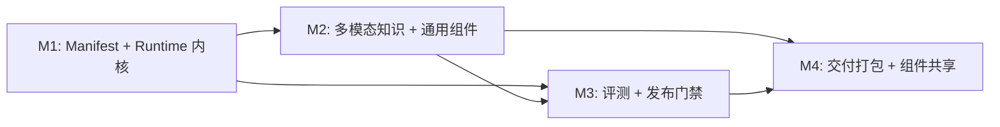

<!--
  Solution-as-Code FDE 平台 —— 开发推进计划书
  基于 solution-as-code-userstory.md、solution-as-code-fde-platform-design.md、
  solution-as-code-fde-platform-technical-architecture.md 三份文档整合制定。
  计划周期：约 6.5 周（M1–M4），不含 STORY-006b（P2 后续迭代）。
-->

# Solution-as-Code FDE 平台 —— 开发推进计划书

## 文档说明

本计划书将三份方案文档（用户故事、平台详细设计、技术架构规范）中的内容整合为一套可逐周执行、可验收的工程计划。每个里程碑（M1–M4）明确列出：目标、交付物清单、关联用户故事、详细任务拆分、验收标准、风险与缓解。

---

## 总览

| 里程碑 | 阶段名称 | 周期 | 关联故事 | 核心交付 |
|--------|---------|------|---------|---------|
| M1 | Manifest 解析器与 Runtime 内核 | 2 周 | STORY-001, STORY-003, STORY-004 | solution validate/run，Chat + W2A 入口，工作流执行，Trace |
| M2 | 多模态知识与通用组件集 | 2 周 | STORY-006a | solution ingest，组件注册表，通用组件库，方案模板，Python Worker 原型 |
| M3 | 多模式评测与发布门禁 | 1.5 周 | STORY-002, STORY-005（部分） | solution evaluate，solution release（评测门禁部分），类型流校验 |
| M4 | 交付打包、组件共享与模板市场 | 1 周 | STORY-005（收尾）, STORY-007 | solution release 完整链路，Docker Compose 产物，组件发布，复用率统计 |

> **注**：STORY-006b（知识变更自动化与专家工作台，P2）不在 MVP 范围内，作为 M4 之后的独立迭代规划。

---

## M1：Manifest 解析器与 Runtime 内核（2 周）

### 目标

证明一份声明式 Manifest 可以驱动完整 FDE 解决方案：从 solution validate 校验通过，到 solution run 启动可交互的 PoC 服务，支持 Chat 和 W2A Signal 两种触发路径，生成完整 JSON Trace。

### 关联用户故事

| 故事ID | 标题 | 优先级 | 故事点 |
|--------|------|--------|--------|
| STORY-001 | 通过声明式 Manifest 快速创建售后问答 PoC | P0 | 5 |
| STORY-003 | 接入工单系统事件，由业务信号触发工作流 | P0 | 5 |
| STORY-004 | 用 mock action 自动创建紧急工单 | P0 | 3 |

### M1 交付物清单

1. Go CLI 二进制 solution，含 validate 和 run 子命令
2. Manifest Loader：YAML 解析 -> 强类型 Go struct，保留源位置信息
3. Manifest Validator：分阶段校验（结构->唯一ID->交叉引用->密钥引用->工作流语法->数据流->组件契约->知识 Schema）
4. Environment Resolver：--env 选择环境，解析 env:VAR_NAME，应用覆盖白名单
5. Component 接口 + RuntimeContext 接口稳定化（含 Knowledge()、Model()、Logger() 能力入口）
6. Component Registry 框架：内置组件 map，方案级自定义组件发现（components/ 目录扫描 + component.yaml 加载）
7. WorkflowExecutor：线性节点序列 + 简单 when + continueOnFailure + fallback + retry
8. POST /chat HTTP 端点 + Manifest 声明的 W2A Webhook 端点（如 POST /w2a/tickets）
9. W2A SignalRouter：Signal 校验、认证、类型白名单、幂等保护、RuntimeRequest 归一化
10. JSONL Knowledge Loader：内存关键词索引、最小质量报告、context.knowledge.Retrieve()
11. 7 个内置组件（版本 @1.0.0）：
    - `registry.intent.support-router@1.0.0`（通用意图分类器）
    - `registry.intent.beverage-router@1.0.0`（饮品场景意图分类器）
    - `registry.intent.severity-beverage@1.0.0`（饮品场景严重度判断）
    - `registry.retriever.local-keyword@1.0.0`（关键词检索器）
    - `registry.agent.cited-answer@1.0.0`（带引用回答生成器）
    - `registry.action.human-handoff@1.0.0`（人工升级）
    - `registry.action.mock-create-service-ticket@1.0.0`（mock 工单创建）
12. JSON Trace Writer：每次请求一个 Trace，每个节点一个 span
13. 售后助手示例 Manifest + JSONL 知识源 + W2A webhook 入口 + JSON Trace
### M1 详细任务拆分

#### 第 1 周：基础设施与核心类型

| 编号 | 任务 | 估时 | 产出 | 依赖 |
|------|------|------|------|------|
| T1.1 | 初始化 Go 仓库结构与模块 | 0.5d | go.mod，cmd/solution/main.go，internal/ 骨架 | — |
| T1.2 | 定义 Manifest Go 类型（SolutionManifest 及全部子 struct） | 1d | internal/manifest/types.go | T1.1 |
| T1.3 | 实现 Manifest Loader（YAML -> Go struct，保留源位置） | 0.5d | internal/manifest/loader.go | T1.2 |
| T1.4 | 实现 Manifest Validator 框架 + 结构校验 + 唯一 ID 校验 | 1d | internal/manifest/validator.go，错误格式统一 | T1.2, T1.3 |
| T1.5 | 实现交叉引用校验（组件引用、工作流节点引用、知识源引用） | 0.5d | Validator 第二阶段 | T1.4 |
| T1.6 | 实现密钥引用校验 + 工作流语法/数据流校验 | 0.5d | Validator 第三、四阶段 | T1.4 |
| T1.7 | 定义 Component 接口 + RuntimeContext 接口 | 0.5d | internal/component/component.go，internal/component/context.go | T1.1 |
| T1.8 | 定义 Workflow 相关类型（节点、when、inputMapping） | 0.5d | internal/workflow/types.go | T1.2 |

**第 1 周验收**：solution validate 可对 Manifest 执行完整校验，覆盖结构、引用、工作流数据流三类错误。

#### 第 2 周：Runtime 执行链路

| 编号 | 任务 | 估时 | 产出 | 依赖 |
|------|------|------|------|------|
| T2.1 | 实现 Environment Resolver | 0.5d | internal/environment/resolver.go | T1.2 |
| T2.2 | 实现 Component Registry（内置 map + 方案级发现） | 0.5d | internal/registry/registry.go | T1.7 |
| T2.3 | 实现 7 个内置组件 | 2d | internal/component/builtin/ 下各组件文件 | T1.7, T2.2 |
| T2.4 | 实现 WorkflowExecutor（线性执行、when、continueOnFailure、fallback、retry） | 1.5d | internal/workflow/executor.go | T1.8, T2.3 |
| T2.5 | 实现 JSONL Knowledge Loader + 内存关键词索引 + 质量报告 | 1d | internal/knowledge/loader.go，internal/knowledge/index.go | T1.2 |
| T2.6 | 实现 Model Gateway（OpenAI-compatible adapter + mock provider） | 0.5d | internal/model/gateway.go | T1.1 |
| T2.7 | 实现 W2A SignalRouter（Sensor 解析、Signal 校验、认证、幂等） | 1d | internal/w2a/router.go，internal/w2a/idempotency.go | T1.2 |
| T2.8 | 实现 HTTP Server（/health、/chat、动态 endpointPath） | 0.5d | internal/api/server.go | T2.4, T2.7 |
| T2.9 | 实现 JSON Trace Writer | 0.5d | internal/trace/writer.go | T1.1 |
| T2.10 | 实现 Response Mapping（answer/intent/confidence/citations/actions 组装） | 0.5d | internal/api/response.go | T2.4 |
| T2.11 | 编写售后助手示例 Manifest + JSONL 知识源 | 0.5d | examples/after-sales-support/ | T2.4, T2.5 |
| T2.12 | 端到端联调 + Bug 修复 | 1d | 全链路跑通 | 以上全部 |

**第 2 周验收**：solution run 启动后，Chat 和 W2A Signal 均能触发同一工作流，返回带引用和 Trace 的响应。

### M1 验收标准（对应 MVP 验收标准 1-7, 11-13, 15）

- [ ] solution run manifest.yaml --env=poc 启动可交互 PoC 服务
- [ ] POST /chat 返回 {answer, intent, confidence, citations, traceId}
- [ ] W2A Signal 通过 endpointPath 触发同一工作流，返回正确响应
- [ ] Chat 和 W2A Signal 归一化为标准 RuntimeRequest，进入同一个 WorkflowExecutor
- [ ] workflow.inputMapping 可将 signal.source_event.data.description 映射为工作流输入 message
- [ ] 删除运行态数据后重新运行，可重建相同状态
- [ ] 每次请求生成一条完整 JSON Trace
- [ ] Manifest 和 Trace 中不存储明文密钥
- [ ] when 条件只能通过 node_id.field 访问上游节点输出，隐式变量引用被校验拒绝
- [ ] 引用可能被跳过节点输出的 workflow.nodes[].inputs 在 solution validate 时失败
- [ ] FDE 按 Component SDK 规范编写的自定义组件可被自动发现、加载和校验

### M1 风险与缓解

| 风险 | 影响 | 缓解 |
|------|------|------|
| WorkflowExecutor 实现比预期复杂 | 延期 | M1 只做线性序列 + 简单 when，不做分支/并行/子工作流 |
| 7 个内置组件开发量大 | 加班或裁剪 | 优先保证 classifier + retriever + generator + handoff 四个核心组件 |
| Model Gateway 依赖外部 API 不稳定 | 测试阻塞 | 内置 mock provider，CI 不依赖外部模型供应商 |
| W2A Signal 协议细节理解偏差 | 集成返工 | 严格参照设计文档中的 W2A envelope 示例实现，编写 fixture 驱动 |

---

## M2：多模态知识与通用组件集（2 周）

### 目标

将知识工程从启动时加载 JSONL 升级为完整的摄取流水线，支持多类型知识源、质量门禁和持久化；完善组件注册表为本地目录结构；交付通用组件库和方案模板，实现选择模板->修改配置->拉起方案的装配模式。

### 关联用户故事

| 故事ID | 标题 | 优先级 | 故事点 |
|--------|------|--------|--------|
| STORY-006a | 手动触发知识摄取并执行质量门禁 | P1 | 3 |

### M2 交付物清单

1. 本地组件注册表目录结构：components/registry/<namespace>/<name>/<version>/component.yaml
2. 组件引用与版本解析，含 requires 能力校验
3. 通用组件库完整实现：llm-classifier、llm-extractor、llm-generator、data-query、rule-evaluator、http-caller、human-handoff
4. KnowledgeReader 扩展为多模态检索接口，支持 CSV 表格型知识源
5. solution ingest 命令：支持 document/table/rules 知识源类型，执行质量门禁
6. 知识单元持久化（PostgreSQL schema 实现）
7. Python Worker 原型：PDF/Word/Markdown -> JSONL，CSV/Excel -> 标准化表格格式
8. RuntimeContext.Model() 与 RuntimeContext.HTTP() 能力完整实现
9. 内置方案模板（至少 3 个）：客服问答、数据查询、告警升级
10. 前端控制台按 solutionType 展示不同配置表单（可选，标记为 Phase 2 前端预留）

### M2 详细任务拆分

#### 第 3 周：组件注册表与知识摄取

| 编号 | 任务 | 估时 | 产出 | 依赖 |
|------|------|------|------|------|
| T3.1 | 实现本地 ComponentRegistry 目录扫描 + component.yaml 加载 | 1d | internal/registry/local.go | M1 T2.2 |
| T3.2 | 实现 requires 能力校验（solution validate 阶段） | 0.5d | Validator 扩展 | T3.1 |
| T3.3 | 实现通用组件库完整实现（llm-extractor, data-query, rule-evaluator, http-caller） | 1.5d | internal/component/builtin/ 扩展 | M1 T2.3 |
| T3.4 | 设计并实现 PostgreSQL schema（knowledge_units, knowledge_embeddings 表） | 0.5d | internal/storage/postgres/schema.go，migration 文件 | — |
| T3.5 | 实现 KnowledgeReader 扩展：CSV 表格型知识源（SQLite 内存表查询） | 1d | internal/knowledge/reader.go 扩展 | M1 T2.5 |
| T3.6 | 实现 solution ingest 命令框架 | 0.5d | cmd/solution/ingest.go | T3.5 |
| T3.7 | 实现知识质量门禁引擎（missing_required_fields, conflicting_answers, stale_content） | 1d | internal/knowledge/quality.go | T3.6 |
| T3.8 | 实现知识单元 PostgreSQL 写入 | 0.5d | internal/knowledge/store.go | T3.4, T3.6 |

**第 3 周验收**：solution ingest 可对 JSONL 知识源执行质量门禁，block 级失败阻止入库，warn 级通过但记录告警。

#### 第 4 周：Python Worker、模板与能力完善

| 编号 | 任务 | 估时 | 产出 | 依赖 |
|------|------|------|------|------|
| T4.1 | 搭建 Python Worker 工程骨架 | 0.5d | workers/knowledge/，pyproject.toml | — |
| T4.2 | 实现 PDF/Word/Markdown -> JSONL 解析流水线 | 1.5d | workers/knowledge/parser.py | T4.1 |
| T4.3 | 实现 CSV/Excel -> 标准化表格格式流水线 | 0.5d | workers/knowledge/table_parser.py | T4.1 |
| T4.4 | Go ingest 调用 Python Worker（子进程，文件系统交换 JSONL） | 0.5d | internal/knowledge/python_bridge.go | T3.6, T4.2 |
| T4.5 | Model Gateway 增强（多供应商路由预留、成本控制、配额管理）；M1 已有基于环境密钥的最小实现 | 0.5d | internal/model/gateway.go 增强 | M1 T2.6 |
| T4.6 | 实现 RuntimeContext.HTTP() 能力 | 0.5d | internal/component/context_http.go | M1 T1.7 |
| T4.7 | 编写 3 个内置方案模板 Manifest（客服问答、数据查询、告警升级） | 1d | templates/ 目录 | M1 T2.11 |
| T4.8 | 模板加载与 solution run --template <name> 支持 | 0.5d | CLI 扩展 | T4.7 |
| T4.9 | 端到端联调 + Bug 修复 | 0.5d | 全链路跑通 | 以上全部 |

**第 4 周验收**：选择平台内置模板，修改知识源路径和配置后 solution run 可拉起不同方案，全程不写组件代码。

### M2 验收标准（对应 MVP 验收标准 8, 14, 16）

- [ ] solution ingest 命令可用，支持 JSONL 和 Markdown 知识源
- [ ] missing_required_fields 的 block 语义有效
- [ ] conflicting_answers 的 warn 语义有效
- [ ] 质量报告可被 knowledge_quality_passed release check 消费
- [ ] FDE 选择平台内置模板，修改知识源路径和 prompt 配置后，solution run 可拉起一个不同于售后问答的方案
- [ ] 同一个通用组件（如 llm-classifier）通过不同 Manifest 配置适配不同行业和场景
- [ ] Python Worker 可将 PDF/Word/Markdown 转换为符合 Schema 的 JSONL
- [ ] RuntimeContext.HTTP() 可供组件调用外部 API

### M2 风险与缓解

| 风险 | 影响 | 缓解 |
|------|------|------|
| PDF 解析质量不达预期 | 知识单元质量低 | Python Worker 采用成熟库（pdfplumber/PyMuPDF），输出 JSONL 供 Go 侧门禁校验 |
| PostgreSQL schema 设计需迭代 | 后续迁移成本 | 设计阶段预留 extension 字段（jsonb），knowledge_embeddings 表按 solution/profile 独立创建 |
| 通用组件配置复杂度超预期 | 组件数量膨胀 | 坚持少量高可配置组件策略，组件行为由 Manifest config 定义，不新增变体组件 |

---

## M3：多模式评测与发布门禁（1.5 周）

### 目标

建立完整的评测体系：支持 Golden Cases 驱动的自动化评测，按方案类型区分评测指标，将门禁检查内建到发布流程中。实现 solution evaluate 和 solution release 的评测门禁部分。

### 关联用户故事

| 故事ID | 标题 | 优先级 | 故事点 |
|--------|------|--------|--------|
| STORY-002 | 用标准评测集量化方案质量并设置发布门禁 | P0 | 3 |
| STORY-005 | 从 PoC 平滑发布到生产环境 | P0 | 5（部分：评测门禁部分） |

### M3 交付物清单

1. solution evaluate 命令：读取 JSONL Golden Cases，执行评测，输出指标和门禁状态
2. Golden Cases 支持 runtime_request_jsonl 格式，覆盖 Chat 触发和 W2A Signal 触发
3. 评测指标按 solutionType 区分：问答用 citation_coverage + answer_accuracy，查询用 result_accuracy，告警用 escalation_precision
4. 评测指标可注册：每种方案类型自带默认指标集
5. solution release 的 eval_gates_passed 检查：现场执行 schedule: onRelease 且 severity: block 的门禁
6. 门禁阻断功能：block 失败退出码 1，warn 失败退出码 0 但输出告警
7. 组件间类型流校验：Validator 检查工作流上下游节点的 input/output schema 类型兼容性（原第8项上移）

9. Trace 数据可用于评测调试

### M3 详细任务拆分

#### 第 5 周：评测引擎

| 编号 | 任务 | 估时 | 产出 | 依赖 |
|------|------|------|------|------|
| T5.1 | 定义 Golden Case JSONL 格式（runtime_request_jsonl 模型） | 0.5d | test/fixtures/eval_golden.jsonl 示例 | M1 T2.4 |
| T5.2 | 实现评测执行器（进程内 WorkflowExecutor，不依赖 HTTP 端口） | 1d | internal/evaluation/runner.go | T5.1, M1 T2.4 |
| T5.3 | 实现 citation_coverage 评测指标 | 0.5d | internal/evaluation/metrics/citation_coverage.go | T5.2 |
| T5.4 | 实现 answer_accuracy 评测指标（规则断言：expected.answerContains 词项全部命中则该 case 通过；后续版本可替换为 LLM-as-judge） | 0.5d | internal/evaluation/metrics/answer_accuracy.go | T5.2 |
| T5.5 | 实现评测指标注册机制（按 solutionType 加载默认指标集） | 0.5d | internal/evaluation/registry.go | T5.3, T5.4 |
| T5.6 | 实现 solution evaluate CLI 命令 | 0.5d | cmd/solution/evaluate.go | T5.2 |
| T5.7 | 实现门禁检查引擎（block/warn 语义，schedule 过滤） | 0.5d | internal/evaluation/gates.go | T5.2 |
| T5.8 | 评测结果 -> Trace 关联（通过 TraceReader 下钻） | 0.5d | internal/evaluation/trace_link.go | T5.2, M1 T2.9 |

**第 5 周验收**：solution evaluate 执行 Golden Cases，输出 citation_coverage 和 answer_accuracy，block 失败返回退出码 1。

#### 第 6 周前 3 天：类型流校验与发布集成

| 编号 | 任务 | 估时 | 产出 | 依赖 |
|------|------|------|------|------|
| T6.1 | 评测引擎优化与 Bug 修复（缓冲任务） | 1d | 评测链路稳定性加固 | T5.2-T5.8 |
| T6.2 | 实现组件间类型流校验（Validator 扩展） | 1d | internal/manifest/validator_dataflow.go | M1 T1.4, T5.5 |
| T6.3 | solution release 集成 eval_gates_passed 检查 | 0.5d | internal/release/checker.go | T5.7 |
| T6.4 | 端到端联调 + Bug 修复 | 0.5d | 全链路跑通 | 以上全部 |

**第 6 周前 3 天验收**：solution release 在评测门禁未通过时阻断发布，组件间类型流校验生效。

### M3 验收标准（对应 MVP 验收标准 8, 12-13）

- [ ] solution evaluate 命令可用，输出结果可读，--json 提供 warnings 与 warnings_exist
- [ ] Golden Case 的 JSONL 格式文档已提供，支持 runtime_request_jsonl
- [ ] 当 citation_coverage 低于 0.95 时，solution release 必须失败（对应 MVP 验收标准 8）
- [ ] schedule: weekly 的门禁不阻断 release，仅输出告警
- [ ] 评测结果与 Trace 数据关联，可下钻分析

- [ ] 工作流上下游节点的 input/output schema 类型不兼容时 validate 失败

### M3 风险与缓解

| 风险 | 影响 | 缓解 |
|------|------|------|
| answer_accuracy 依赖 LLM-as-judge，外部模型不稳定 | 评测结果波动 | 支持配置 judge model，评测结果带 model 版本号，允许一定容差 |

| 类型流校验规则复杂 | Validator 实现周期长 | 先实现扁平字段类型校验（string/number/boolean/object/array），复杂嵌套类型留到后续 |

---

## M4：交付打包、组件共享与模板市场（1 周）

### 目标

完成 solution release 的完整发布检查链路，生成可一键启动的生产部署包；支持组件发布和方案模板共享；建立复用率度量的数据基础。实现 PoC 和生产环境使用同一份 Manifest，消除环境漂移。

### 关联用户故事

| 故事ID | 标题 | 优先级 | 故事点 |
|--------|------|--------|--------|
| STORY-005 | 从 PoC 平滑发布到生产环境 | P0 | 5（收尾） |
| STORY-007 | 复用于新品牌——资产复用与快速交付 | P1 | 3 |

### M4 交付物清单

1. --env=production 解析生产配置（模型策略、密钥、trace 路径等覆盖）
2. 完整 8 项发布检查链路：model_credentials_configured、sensor_credentials_configured、action_credentials_configured、signal_ingress_reachable、knowledge_quality_passed、eval_gates_passed、observability_enabled、security_baseline_passed
3. solution release 成功时生成 ./deploy/<env>/，含 docker-compose.yaml、.env.example、运行说明和重建说明
4. docker-compose.yaml 启动同一 Go Runtime 二进制和同一份 Manifest/config
5. solution component publish 命令：FDE 将自定义组件打包发布到团队共享仓库
6. 方案模板市场：FDE 可发布验证过的方案模板供团队复用
7. 复用率统计：自动计算新方案中引用已有组件和模板的比例
8. 新品牌复用的端到端验证（乐源 -> 果燃）
9. （可选）solution destroy 命令：清理部署资源和运行时持久化数据，不删除原始知识源、评测数据集和 Trace 归档

### M4 详细任务拆分

#### 第 6 周后 2 天：发布检查链路

| 编号 | 任务 | 估时 | 产出 | 依赖 |
|------|------|------|------|------|
| T7.1 | 实现 model/sensor/action 凭证检查 | 0.5d | internal/release/checks/credentials.go | M1 T2.1 |
| T7.2 | 实现 signal_ingress_reachable 检查 | 0.25d | internal/release/checks/ingress.go | M1 T2.7 |
| T7.3 | 实现 knowledge_quality_passed 检查（读取质量报告） | 0.25d | internal/release/checks/knowledge.go | M2 T3.7 |
| T7.4 | 实现 observability_enabled 检查 | 0.25d | internal/release/checks/observability.go | M1 T2.9 |
| T7.5 | 实现 security_baseline_passed 检查（PII 检测、prompt injection 防御配置） | 0.25d | internal/release/checks/security.go | M1 T1.4 |
| T7.6 | 实现 Release Checker 编排器（顺序执行，任一失败阻断） | 0.5d | internal/release/checker.go 完善 | T7.1-T7.5, M3 T6.3 |

**第 6 周后 2 天验收**：solution release 执行全部 8 项检查，任一 block 失败退出码 1，不生成部署产物。

#### 第 7 周前 3 天：部署产物与组件共享

| 编号 | 任务 | 估时 | 产出 | 依赖 |
|------|------|------|------|------|
| T8.1 | 实现 Docker Compose 产物生成器 | 0.5d | internal/delivery/docker_compose.go | T7.6 |
| T8.2 | 编写 .env.example 模板 + 运行说明 + 重建说明生成 | 0.5d | internal/delivery/docs.go | T8.1 |
| T8.3 | 实现 solution component publish 命令 | 0.5d | cmd/solution/publish.go | M2 T3.1 |
| T8.4 | 实现方案模板发布与市场机制 | 0.5d | internal/registry/marketplace.go | M2 T4.7 |
| T8.5 | 实现复用率统计（组件引用计数 + 模板引用检测） | 0.5d | internal/registry/reuse_stats.go | T8.4 |
| T8.6 | 新品牌复用端到端验证（乐源 -> 果燃，修改知识源 + Sensor + 评测集） | 0.5d | examples/guoran-support/ | M1 T2.11 |
| T8.7 | 端到端联调 + Bug 修复 | 0.5d | 全链路跑通 | 以上全部 |
| T8.8 | （可选）实现 solution destroy 命令 | 0.25d | cmd/solution/destroy.go | T7.6 |

**第 7 周前 3 天验收**：solution release 成功生成部署包，docker-compose up 后行为与 solution run 等价；solution component publish 可将组件打包发布。

### M4 验收标准（对应 MVP 验收标准 8-10）

- [ ] solution release 在全部检查通过后生成 ./deploy/<env>/ 部署产物
- [ ] model_credentials_configured、sensor_credentials_configured、action_credentials_configured、signal_ingress_reachable 在配置缺失时使 release 失败（对应 MVP 验收标准 9）
- [ ] 增加或选择 production 环境时，只改变环境配置，不改变工作流逻辑（对应 MVP 验收标准 10）
- [ ] docker-compose.yaml 启动同一个 Runtime 二进制和同一份 Manifest/config，行为与 solution run 等价
- [ ] 同一份 Manifest 从 poc 提升到 production，无需修改工作流逻辑
- [ ] solution component publish 输出 <name>-<version>.tar.gz 包
- [ ] 新品牌 PoC 在一天内完成交付演示，组件复用率 > 80%
- [ ] 复用率统计在平台资产看板中展示

### M4 风险与缓解

| 风险 | 影响 | 缓解 |
|------|------|------|
| signal_ingress_reachable 检查在不同部署目标中适配困难 | 检查不稳定 | 非 Docker Compose 目标（K8s Ingress、VPC 内网）的具体探测适配方式列为待决策项 |
| 组件发布涉及版本冲突 | 注册表数据损坏 | 发布前校验版本唯一性，冲突时提示已有版本信息 |
| 部署产物与 solution run 行为不一致 | 环境漂移 | docker-compose.yaml 必须启动同一二进制和同一份 Manifest，CI 中增加一致性测试 |

---

## 附录 A：用户故事 -> 里程碑映射矩阵

| 故事ID | 标题 | 优先级 | 故事点 | M1 | M2 | M3 | M4 |
|--------|------|--------|--------|----|----|----|----|
| STORY-001 | 声明式 Manifest 快速创建 PoC | P0 | 5 | 核心 | — | — | — |
| STORY-002 | 标准评测集 + 发布门禁 | P0 | 3 | — | — | 核心 | — |
| STORY-003 | W2A 事件驱动工作流触发 | P0 | 5 | 核心 | — | — | — |
| STORY-004 | Mock action 自动建单 | P0 | 3 | 核心 | — | — | — |
| STORY-005 | PoC 平滑发布到生产 | P0 | 5 | — | — | 部分 | 收尾 |
| STORY-006a | 手动知识摄取 + 质量门禁 | P1 | 3 | — | 核心 | — | — |
| STORY-006b | 知识变更自动化 + 专家工作台 | P2 | 5 | — | — | — | 后续 |
| STORY-007 | 资产复用 + 快速交付新品牌 | P1 | 3 | — | — | — | 核心 |

---

## 附录 B：技术栈总览

| 层级 | MVCR（M1-M4） | 生产演进 |
|------|--------------|----------|
| CLI | Go + Cobra | 同一二进制 |
| API Server | Go + chi 或 Gin | Go + OpenAPI + mTLS/Ingress |
| Workflow Runtime | Go | 独立 Runtime Deployment |
| Manifest 校验 | Go + go-yaml + 自定义语义校验 | JSON Schema + IDE 插件 |
| 组件执行 | Go 内置组件 | gRPC/插件进程/沙箱执行 |
| 知识加载 | Go JSONL loader | Python ingestion worker |
| 知识索引 | 内存关键词索引（M1）-> PostgreSQL FTS（M2） | pgvector |
| 模型网关 | Go interface + OpenAI-compatible adapter | 多供应商路由、配额、成本控制 |
| 评测 | Go in-process runner | Python/Go hybrid evaluator |
| 数据库 | SQLite（M1）-> PostgreSQL（M2+） | PostgreSQL HA |
| 队列 | 进程内任务 | Redis / NATS |
| 对象存储 | 本地文件 | S3/MinIO |
| 可观测性 | JSON Trace + structured logs | OpenTelemetry + Collector |
| 前端 | 不实现（目录预留） | React + TypeScript + TanStack |
| 部署 | Docker Compose | Kubernetes + Helm |

---

## 附录 C：仓库目录结构


---

## 附录 D：测试策略

### 单元测试（每模块必须）

| 模块 | 测试重点 |
|------|---------|
| manifest/loader | YAML 解析正确性、错误位置保留 |
| manifest/validator | 结构校验、交叉引用、工作流数据流、密钥引用 |
| workflow/executor | when 解析、节点执行顺序、continueOnFailure、fallback、retry |
| workflow/input_mapping | 简单路径映射、必填字段缺失 |
| environment/resolver | 环境选择、env:VAR_NAME 解析、白名单覆盖 |
| knowledge/loader | JSONL 解析、质量报告生成、空文件处理 |
| knowledge/quality | missing_required_fields、conflicting_answers 门禁 |
| w2a/router | Signal 校验、认证、类型白名单、幂等 |
| component/builtin | 各组件的输入/输出契约 |
| evaluation/runner | Golden Case 执行、指标计算 |
| evaluation/gates | block/warn 语义、schedule 过滤 |
| release/checks | 各项检查的通过/失败条件 |

### 集成测试（每个里程碑收尾）

| 测试场景 | 里程碑 |
|---------|--------|
| solution validate 成功与失败 | M1 |
| solution run 后 /chat 返回 answer/citations/traceId | M1 |
| /w2a/tickets bearer token 成功触发工作流 | M1 |
| 认证失败不进入工作流 | M1 |
| 相同 signal_id 重复发送不重复执行 | M1 |
| Trace 文件生成 | M1 |
| solution ingest 执行质量门禁 | M2 |
| Python Worker PDF -> JSONL 流水线 | M2 |
| solution evaluate 产生指标 | M3 |
| solution release 在 gate 失败时退出 1 | M3 |
| solution release 成功时生成 ./deploy/<env>/ | M4 |
| schedule: weekly 门禁失败不阻断 release | M3 |
| docker-compose up 后行为与 solution run 等价 | M4 |

### 契约测试（Fixture 维护）

- Manifest fixture（合法/非法各一套）
- Component input/output fixture
- RuntimeRequest fixture（Chat 触发 + W2A Signal 触发）
- W2A Signal fixture（合法/非法）
- Trace fixture
- Eval JSONL fixture

---

## 附录 E：CI/CD 管道

### Go CI

```yaml
steps:
  - go test ./...
  - go vet ./...
  - golangci-lint run
  - go build ./cmd/solution
  - go build ./cmd/solution-server
```

### Python Worker CI

```yaml
steps:
  - uv sync
  - ruff check .
  - mypy .
  - pytest
```

### 质量门槛

- 所有示例 Manifest 必须 validate 通过（CI 中自动执行）
- 所有 release gate 测试必须稳定
- 核心模块必须有单元测试
- CI 不依赖外部模型供应商，模型调用使用 mock provider
- 每个里程碑收尾前运行全量集成测试

---

## 附录 F：里程碑间依赖关系



- M1 是所有后续里程碑的基础：Manifest 类型、Validator、WorkflowExecutor、Component 接口、Trace Writer 在 M1 定型后不再大改
- M2 的组件注册表和知识摄取能力是 M3 评测（依赖知识质量报告）和 M4 组件发布的前置
- M3 的评测门禁是 M4 发布检查链路中 eval_gates_passed 和 knowledge_quality_passed 的前置
- M4 将 M1-M3 的能力串联为完整的交付闭环

---

## 附录 G：团队与角色建议

| 角色 | 人数 | 主要职责 |
|------|------|---------|
| Go 平台开发 | 2-3 人 | Manifest/Runtime/Workflow/Component/Registry/Evaluation/Release |
| Python Worker 开发 | 1 人 | 知识工程 Worker（PDF/Word/Markdown/CSV 解析） |
| 测试/QA | 1 人（可兼任） | 单元测试、集成测试、契约测试、CI 维护 |
| FDE 代表（周远） | 1 人 | 示例 Manifest 编写、场景验证、验收测试 |

> M1-M2 阶段 Go 平台开发需要至少 2 人并行推进（一人负责基础设施与校验，一人负责 Runtime 执行链路与组件）；M3-M4 阶段可 2 人并行（一人负责评测，一人负责发布与交付）。

---

## 附录 H：关键决策记录

| 决策项 | 决策 | 依据 |
|--------|------|------|
| 主语言 | Go（内核）+ Python（Worker） | Go 适合单二进制交付和并发 Runtime；Python 适合文档解析和 AI 生态 |
| 起步架构 | 模块化单体 | Manifest/Runtime/组件/知识/Trace/评测需快速共享领域模型 |
| M1 检索方案 | 内存关键词索引 | 验证检索接口契约，后续平滑切换到 PostgreSQL FTS + pgvector |
| 组件注册表 M1 | 内置 map + 方案级目录扫描 | 先验证发现和加载机制，M2 扩展为完整本地目录结构 |
| W2A 集成方式 | Adapter 模式，不嵌入 W2A 仓库 | 平台独立，W2A 仅作为感知协议输入 |
| 前端 | M1-M4 不实现，目录预留 | MVP 聚焦 Runtime 内核，前端在后续迭代中按需建设 |
| solution destroy | M4 可选实现 | 语义仅限清理部署资源和运行时数据，不删除原始知识源和 Trace 归档 |

---

## 附录 I：后续迭代规划（M4 之后）

| 优先级 | 能力 | 关联故事 |
|--------|------|---------|
| P2 | 子工作流引擎（节点引用命名工作流，支持模块化方案组装） | — |
| P2 | 知识变更自动化 + 专家工作台（文件监听、冲突审阅、增量索引） | STORY-006b |
| P2 | Kubernetes 原生部署（Helm Chart、Operator） | — |
| P2 | 前端控制台（Manifest 编辑器、知识审阅工作台、Trace/Eval 可视化） | — |
| P2 | SensorHub 集成 + 多 Sensor 编排 + Signal replay | — |
| P3 | 远程组件市场（签名、权限、沙箱执行） | — |
| P3 | 多租户企业级控制平面 | — |
| P3 | 完整可视化工作流构建器 | — |
| P3 | Policy-as-Code 集成 + 审批工作流 | — |
