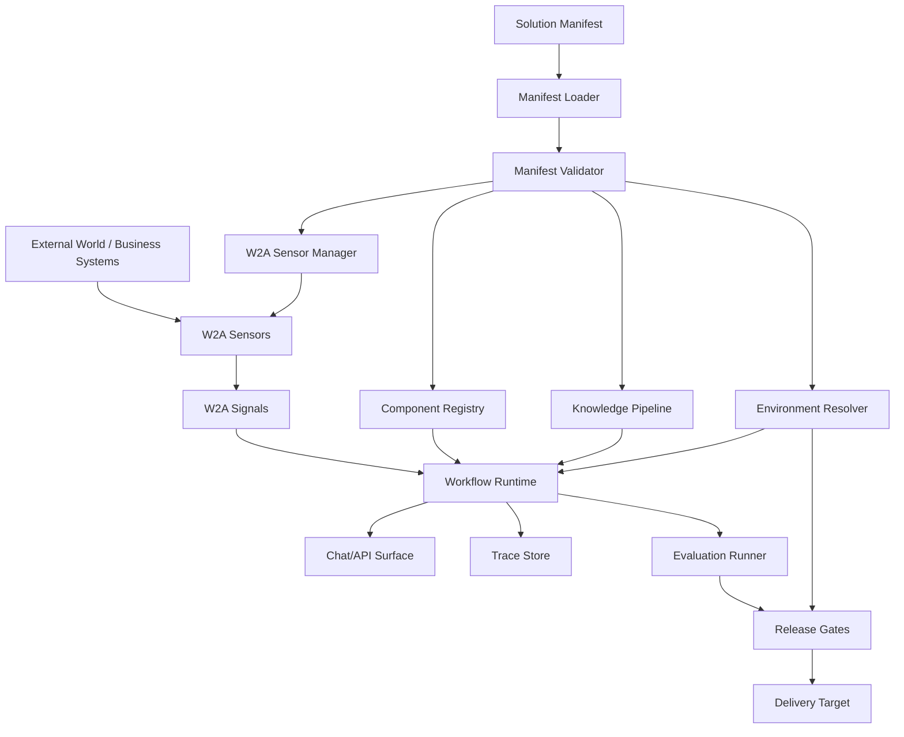
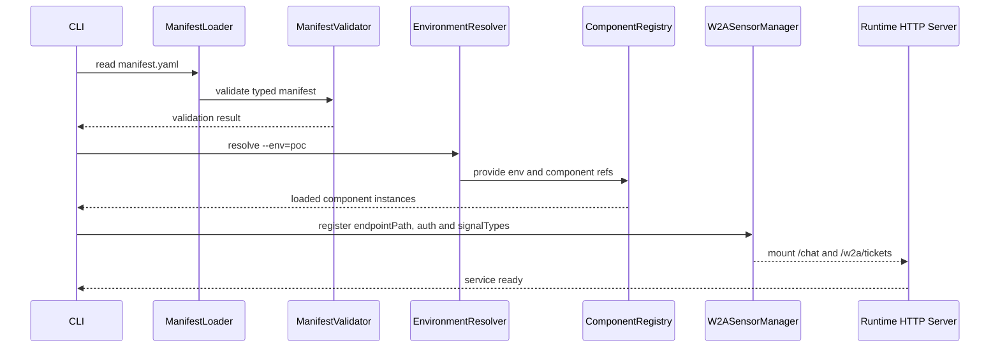
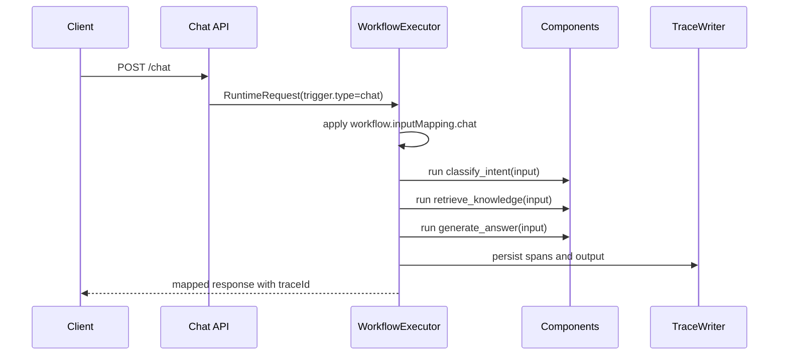
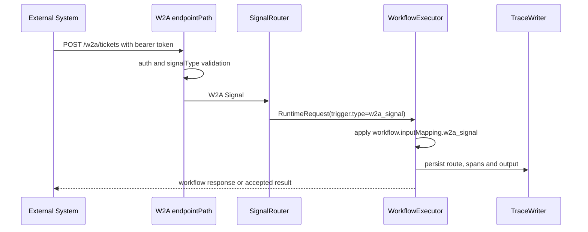

# Solution-as-Code FDE 平台详细设计

## 摘要

本文档定义一个面向 Forward Deployed Engineer（FDE）的 Solution-as-Code
平台。它不是通用的 AI 能力中台，而是一个解决方案工程平台，帮助 FDE
将外部世界信号、客户数据、业务逻辑、可复用资产、评测、可观测性和交付约束，收敛为一份可版本化、可复现、可审查、可执行的解决方案定义。

平台的核心对象是 `Solution`。一个解决方案由声明式 Manifest 定义，并由 Runtime
执行。Manifest 是 W2A 感知入口、知识资产、组件、工作流、运行策略、评测和交付配置的唯一可信源。图形化工具可以存在，但它们只是 Manifest 的编辑器，而不是独立的配置存储。

W2A 在本设计中的定位是 AI 中台的感知层和事件接入层。它通过 Sensor
监听外部数据源，并以 W2A Signal 的形式把结构化、实时的外部世界变化送入 Solution Runtime。W2A 不替代 Agent Runtime、RAG、工作流编排、模型网关或交付治理；它负责标准化“世界发生了什么”，Runtime 负责决定“应该做什么”。

首个 MVP 覆盖 Phase 1-4 四个阶段的交付物。其中 Phase 1 只交付 `solution validate` 和 `solution run` 两个命令及 Runtime 内核；评测、发布门禁、模板系统等能力在后续阶段交付。以下为全阶段 MVP 应证明的端到端闭环：

1. FDE 为售后支持助手编写一份 `Solution` Manifest。
2. 平台校验 Manifest。
3. Runtime 加载 W2A Sensor 声明和本地注册组件。
4. 用户可以调用 `POST /chat`，外部系统事件也可以通过 W2A Signal 触发工作流。
5. 工作流执行 `classify_intent -> retrieve_knowledge -> generate_answer`。
6. 每次调用或事件触发都生成 Trace。
7. 当评测或交付检查失败时，发布门禁可以阻断环境提升。

## 问题陈述

FDE 需要快速交付可信的 AI 解决方案，同时保留足够的工程纪律，让这些方案能够进入生产。在很多 AI 平台建设中，能力往往被拆成一组独立工具：模型网关、RAG 服务、工作流构建器、Prompt 库、评测看板和部署工具。这些工具有助于做 Demo，但在从 PoC 走向生产时经常失败，因为真正的解决方案散落在控制台配置、脚本、文档、隐藏环境假设和 FDE 个人经验中。

这会反复造成以下问题：

- 客户知识被接入了，但没有被工程化为持久、可测试的知识资产。
- 客户系统事件能被接入，但不同来源缺少统一信号协议，Agent 集成逻辑容易碎片化。
- 模板以整项目方式复制，而不是以可组合组件方式复用。
- PoC 环境与生产环境发生配置漂移。
- 评测和可观测性是事后补上的。
- 优秀 FDE 的实践停留在个人经验中，而没有被平台固化为交付约束。

平台应让解决方案本身成为一等工程对象。

## 目标

- 让完整 AI 解决方案可由一份声明式 Manifest 复现。
- 让 FDE 快速构建可信 PoC，同时避免制造一次性原型。
- 通过 W2A Sensor 将外部系统、业务事件和实时变化标准化为可编排的输入信号。
- 将客户知识转化为结构化、可诊断、可改进的资产。
- 让组件能够跨客户、跨行业、跨 FDE 团队复用。
- 将评测、可观测性和交付检查内建到运行路径中。
- 允许 PoC 在不重写核心逻辑的前提下走向生产。

- 让 FDE 在客户现场面对多样化需求时，主要工作为装配而非从零编码：选模板、换数据源、组合组件、调整工作流，几小时内拉出可演示方案。
- 让自定义组件开发有清晰的接口规范和契约约束，FDE 编码时知道输入什么、输出什么、平台提供什么能力，而不是每次翻平台源码摸索接入方式。
## MVP 非目标


- 完整可视化工作流构建器。
- 多租户企业级控制平面。
- 带发布流程的完整组件市场。
- 面向工作流条件的复杂表达式语言。
- 完整 PDF、Word、聊天记录知识工程工作台。
- Kubernetes 原生部署平台。
- 高级离线模型评测框架。
- 端到端密钥管理系统。
- W2A 协议本身或 SensorHub 的完整实现。
- 让 W2A Sensor 承担业务决策、路由优先级或动作执行职责。

这些能力可以在 Manifest 契约和 Runtime 内核验证之后再扩展。

## 设计哲学

### 1. 知识必须被工程化

RAG 不只是文档解析、切片、Embedding 和检索。对 FDE 工作来说，真正昂贵的部分是将杂乱的客户材料转化为 AI 可消化、可审计、高质量的知识资产。

平台应支持：

- 带显式 Schema 的标准知识单元。
- 来源引用与引用要求。
- 缺失字段、过期内容、冲突答案等质量门禁。
- 面向 FDE 和领域专家的人机修正闭环。
- 知识变更后的回归评测。

目标状态不是静态文档库，而是活的企业知识资产。

### 2. 解决方案必须可组合

复用单元不应只停留在“客服助手”这类完整模板上。大型模板适合启动项目，但长期复用来自更小的、可版本化的组件：

- 意图分类器。
- 检索策略。
- Agent 策略。
- Prompt 模块。
- 工具适配器。
- 人工升级规则。
- 评测指标。
- 交付检查。

一个解决方案应该是注册组件和环境配置共同组成的装配图。

### 3. 交付质量必须由平台约束

FDE 的速度不应依赖绕过生产纪律。平台应编码强默认约束：

- Manifest 是唯一可信源。
- 环境由配置重建。
- 生产环境不允许手工补丁。
- 发布检查自动执行。
- 可观测性和评测是必选能力，而不是事后插件。

平台应将资深 FDE 的经验转化为可重复的组织实践。

### 4. 外部世界必须被标准化感知

AI 中台不能只等待用户发起聊天请求。很多 FDE 场景本质上由外部世界变化触发，例如工单状态变化、GitHub Issue 新增、日历事件临近、监控告警出现、CRM 客户阶段变化或行业新闻更新。

W2A 提供这一层的标准化协议：

- Sensor 监听某个数据源或外部系统。
- Sensor 输出遵循 W2A Protocol 的结构化 Signal。
- Runtime 消费 Signal，并将其映射到 Solution 工作流触发器。
- Agent 或 Workflow 根据 Signal、知识和组件执行后续决策。

边界必须明确：Sensor 负责感知，不负责业务决策；W2A Signal 负责描述外部变化，不负责选择动作；Solution Runtime 负责路由、编排、评测和交付约束。

### 5. 装配优先于编码，编码有规范约束

FDE 的核心工作模式不是为每个客户方案编写组件代码，而是在客户现场完成"装配"：

- 80% 的场景：选方案模板、换数据源、调 prompt/规则配置、组合既有组件，不写代码。
- 20% 的场景：当通用组件无法满足特殊需求时，按平台规范实现自定义组件——写代码可以，但不是从零摸索，而是实现一个已知契约。

平台的责任是让"装配"足够强大、让"编码"足够清晰：

- 通用组件库：`llm-classifier`、`llm-generator`、`data-query`、`rule-evaluator`、`http-caller`、`human-handoff` 等少量高度可配置组件，覆盖多数常见方案模式。组件行为由 Manifest 中的 prompt、规则、查询模板完全定义，同一组件通过不同配置适配不同行业和场景。
- 方案模板：平台内置可运行的模板 Manifest（客服问答、数据查询、告警升级、审批流程等），FDE 选择一个作为起点，修改配置和数据源即可拉起新方案。模板引用的是通用组件，FDE 不需要从空白 YAML 开始。
- 组件开发规范（Component SDK）：当通用组件无法满足需求时，FDE 按平台规范实现自定义组件——声明 `component.yaml` 契约（输入/输出 schema、所需能力），实现 `Run(ctx, input, runtime) → output` 接口，将组件放入方案目录。平台自动发现、加载、校验。FDE 的精力花在业务逻辑上，不花在摸索平台源码上。
- 组件发现层级：方案级自定义组件覆盖团队共享组件，团队共享组件覆盖平台内置组件。同名的方案级组件优先加载，使 FDE 可以在不修改平台代码的前提下替换任意组件的实现。

衡量平台成功与否的标准不是内置了多少组件，而是 FDE 从"客户提出需求"到"可演示方案跑起来"的时间——以及其中写代码的比例。

> **阶段说明**：上述装配模式是平台的长期设计目标。Phase 1 尚未实现方案模板，FDE 需直接编写 Manifest；模板系统和通用组件库在 Phase 2 逐步交付。Phase 1 的自定义组件开发仍需按 Component SDK 规范实现完整契约。

## 核心抽象：Solution

`Solution` 是一个 AI 业务解决方案的完整、版本化定义。它包含四类资产。

```yaml
apiVersion: "solution.codex/v1"
kind: Solution
metadata:
  name: after-sales-support
  version: 0.1.0
  owner: fde-team
  industry: manufacturing    # 行业标签，用于行业模板匹配与默认配置推荐
solutionType: customer-support   # 方案类型，决定默认组件、评测指标、模板
perception:
  sensors:
  triggers:
knowledge:
  sources:       # 语义类型：document / table / rules；Phase 1 仅实现 document (JSONL)。`type: jsonl` 等价于 `type: document, format: jsonl`，后续阶段将引入独立 `format` 字段。
  schemas:
  quality_gates:
components:      # 引用通用组件或自定义组件，格式 registry.<namespace>.<name>@<version>
  - id: classify_intent
    category: processor
    ref: registry.intent.support-router@1.0.0
  - id: retrieve_knowledge
    category: processor
    ref: registry.retriever.local-keyword@1.0.0
  - id: generate_answer
    category: processor
    ref: registry.agent.cited-answer@1.0.0
workflow:
  entrypoint: classify_intent  # 必须是 nodes 列表中第一个节点的 id
  nodes:
runtime:
  knowledgeBindings:  # 知识源绑定到特定组件
  modelPolicy:
  observability:
evaluation:
  datasets:
  metrics:
  gates:
delivery:
  environments:
  security:
  releaseChecks:
```

Manifest 是 FDE、W2A Sensor、Runtime、组件注册表、知识流水线、评测系统和交付系统之间的契约。

`solutionType` 是方案的类型标签，决定平台推荐哪些默认组件、评测指标和模板字段。`metadata.industry` 是行业标签，用于行业模板匹配与默认配置推荐（如制造业默认加载设备故障分类模型策略）。平台内置多种方案模板（客服问答、数据查询、告警升级、审批流程等），FDE 选择模板后只需修改配置和数据源，无需从空白 Manifest 开始。

## 架构概览



Runtime 内核应保持小而清晰。平台功能应通过明确契约接入，而不是变成隐藏的全局行为。

## 架构支柱

### W2A 感知层

W2A 是 World2Agent 的缩写，是一个开放协议，用于标准化 AI Agent 如何感知真实世界。它的基本模式是：

```text
World / Business Systems / APIs / SaaS
        ↓
W2A Sensors
        ↓
W2A-formatted Signals
        ↓
Solution Runtime / Agent / Workflow
```

Sensor 是监听单一数据源并发出 W2A Signal 的小程序。它可以监听 GitHub、日历、工单系统、监控系统、CRM、新闻源、数据库变更或客户内部 API。Signal 是 AI 可消费的结构化输入，用于描述外部世界中发生了什么。

在本平台中，W2A 的职责是：

- 标准化外部事件和实时数据输入。
- 让 Solution 可以由业务事件触发，而不只是由聊天请求触发。
- 将数据源接入逻辑与 Agent/Workflow 决策逻辑解耦。
- 让常见外部系统接入能力沉淀为可复用 Sensor。
- 让 FDE PoC 更接近客户真实业务流。

W2A 明确不负责：

- 不替代 Agent Runtime。
- 不替代 RAG 或知识工程流水线。
- 不替代工作流编排。
- 不决定业务动作、优先级或人工升级策略。
- 不承担完整权限治理、发布治理或评测门禁。

MVP 职责：

- 在 Solution Manifest 中声明 W2A Sensor。
- 支持 W2A Signal 作为 Workflow 的触发输入。
- 将 Signal 写入统一 Trace。
- 将 Sensor 运行配置纳入环境解析。

未来职责：

- SensorHub 集成与 Sensor 发现。
- 多 Sensor 组合、过滤和增强。
- Signal replay，用于调试和评测。
- Signal 到 Workflow trigger 的可视化映射。
- Sensor 安全扫描与信任策略。

### 知识工程流水线

知识流水线将原始客户材料转化为结构化知识单元，使其能够被检索、引用、检查和改进。

MVP 职责：

- 读取 Manifest 中声明的知识源。语义类型包括 `document`（文档型）、`table`（表格型）、`rules`（规则型），Phase 1 仅实现 `document` 类型，其唯一实现格式为 JSONL。
- 文档型知识（JSONL）：生成符合声明 Schema 的知识单元，构建关键词索引。
- 表格型知识（CSV、Excel）：加载为内存表，通过 `KnowledgeReader.Retrieve()` 提供结构化查询（Phase 2 扩展为多模态检索接口）。
- 规则型知识：加载为可评估的规则集，通过 `KnowledgeReader.Evaluate()` 提供条件匹配。
- 执行基础质量门禁。
- 持久化质量报告。
- 为检索和查询组件提供统一的知识访问接口。

未来职责：

- 版面感知的文档解析（PDF、Word、Markdown → JSONL）。
- Python Worker 处理重文档解析、OCR、Embedding 生成。
- 跨来源冲突检测。
- 领域专家审阅工作台。
- 知识版本化与回滚。
- Schema 辅助抽取。
- 知识回归测试。
- 向量检索（pgvector）作为关键词检索的补充。

### 可组合资产注册表

注册表是解决方案引用的所有可复用组件的来源。

MVP 职责：

- 解析 `registry.intent.support-router@1.0.0`、`registry.retriever.local-keyword@1.0.0` 这类组件引用。
- 按三层优先级发现组件：方案级自定义组件 → 团队共享组件 → 平台内置组件。Phase 1 中平台内置组件硬编码在 Runtime 二进制内，后续阶段将外部化为可替换的本地或远程注册表目录。
- 从 `component.yaml` 加载组件元数据和契约（input/output/config schema、requires）。
- 将 Manifest 配置绑定到组件实例，按 `configSchema` 校验配置类型。
- 内置通用组件库（llm-classifier、llm-generator、data-query、rule-evaluator、http-caller、human-handoff）。
- 支持方案模板：从 `templates/` 目录加载可运行的模板 Manifest。

未来职责：

- 组件打包与团队共享（`solution component publish`）。
- 语义化版本约束。
- 依赖扫描。
- 组件兼容性检查。
- 行业解决方案包。
- 模板市场（FDE 发布验证过的方案模板供团队复用）。
- 使用分析与复用指标（自动统计新方案中引用已有组件/模板的比例）。

### 约束性交付框架

交付框架让 PoC 和生产成为同一解决方案的不同部署环境，而不是两个独立项目。

MVP 职责：

- 解析环境差异化配置。
- 禁止 Manifest 中出现明文密钥。
- 在环境提升前执行发布检查。
- 支持 `poc` 与 `production` 环境。
- 使用 Docker Compose 等简单目标生成部署产物。

未来职责：

- Kubernetes 部署生成。
- 客户 VPC 集成。
- 不可变环境发布。
- 配置漂移检测。
- Policy-as-Code 集成。
- 审批工作流。

### Solution Runtime

Runtime 读取 Manifest，解析环境，加载组件，执行工作流，记录 Trace，并暴露 API。

Runtime 不只是一个工作流画布。它是把资产、知识、质量、可观测性和交付连接起来的执行环境。

### 组件开发规范（Component SDK）

当通用组件无法满足客户特殊需求时，FDE 需要按平台规范实现自定义组件。平台通过 Component SDK 定义清晰的契约，让 FDE 编码时有章可循。

#### 组件目录约定

自定义组件放在方案目录下，平台自动发现和加载：

```text
my-solution/
  manifest.yaml
  components/                          # 方案级自定义组件
    my-custom-classifier/
      component.yaml                   # 组件契约声明
      component.go                     # 组件实现
  data/
    knowledge.jsonl
```

#### component.yaml 契约

每个自定义组件通过 `component.yaml` 向平台声明其契约：

```yaml
ref: registry.custom.my-classifier@1.0.0
category: processor
inputSchema:
  message: string
outputSchema:
  intent: string
  confidence: number
configSchema:
  labels: array
  model: string?
requires:
  - model.generate
```

契约字段说明：

- `ref`：组件唯一引用标识，遵循 `registry.<namespace>.<name>@<semver>` 格式。
- `category`：`processor`（有输入→有输出）或 `action`（执行副作用）。
- `inputSchema`：输入字段及其类型，用于 Validator 校验工作流节点间的数据流兼容性。
- `outputSchema`：输出字段及其类型，下游节点引用时校验类型匹配。
- `configSchema`：组件配置字段及其类型，`?` 后缀表示可选字段。Manifest 中 `components[].config` 在 `Instantiate()` 时据此校验。
- `requires`：组件所需平台能力清单（`knowledge.search`、`knowledge.query`、`model.generate`、`http.call`）。Runtime 启动时校验能力可用性，不可用在 `solution validate` 阶段报错。

#### Component 接口

FDE 实现自定义组件只需满足 `Component` 接口：

```go
type Component interface {
    ID() string
    Category() ComponentCategory
    Run(ctx context.Context, input map[string]any, runtime RuntimeContext) (map[string]any, error)
}
```

#### RuntimeContext 能力清单

`RuntimeContext` 是平台注入给组件的运行时能力。FDE 在 `component.yaml` 中声明 `requires`，Runtime 启动时校验能力可用性：

```go
type RuntimeContext interface {
    // Phase 1 可用
    Environment() string                 // 当前环境名
    Knowledge() KnowledgeReader          // Retrieve() 知识检索
    Request() RequestMetadata            // 请求元数据（trigger 类型、sensor 信息）
    Error() *RuntimeErrorSummary         // fallback 模式下可读的错误上下文
    Actions() []ActionSummary            // 已完成 action 的结构化摘要
    // Phase 1 可用（模型调用）
    Model() ModelGateway                 // LLM 调用（Phase 1 提供基于环境密钥的最小实现）
    // Phase 2 可用
    HTTP() HTTPCaller                    // 外部 API 调用
    // Phase 1（基础实现）
    Logger() Logger                      // 结构化日志（Phase 1 提供基本实现，满足 Trace 写入和组件调试需求）
}
```

每个能力都是接口，FDE 在 `component.yaml` 里声明 `requires: [model.generate, http.call]`，Runtime 启动时校验该组件所需能力是否可用，不可用则在 `solution validate` 阶段就报错。

#### 组件发现层级

平台按以下优先级发现和加载组件：

1. **方案级自定义组件**（`<manifest目录>/components/`）
2. **团队共享组件**（`$SOLUTION_HOME/components/registry/`）
3. **平台内置组件**（内置通用组件库）

同名的方案级组件覆盖团队级，团队级覆盖平台级。FDE 可以在不修改平台代码的前提下替换任意组件的实现。

#### 通用组件库

平台内置少量高度可配置的通用组件，覆盖多数常见方案模式。组件行为由 Manifest 中的 prompt、规则、查询模板完全定义，同一组件通过不同配置适配不同行业和场景：

| 通用组件（类型） | 类别 | 行为由 Manifest 配置决定 | Phase 1 Ref 示例 |
|----------|------|------------------------|-------------------|
| `llm-classifier` | processor | `prompt` + `labels` → 分类结果 + 置信度 | `registry.intent.support-router@1.0.0` |
| `llm-extractor` | processor | `prompt` + `schema` → 结构化提取 | Phase 2（暂无内置实例）|
| `retriever` | processor | `query` + `topK` → `passages[]` + `citations[]` | `registry.retriever.local-keyword@1.0.0` |
| `llm-generator` | processor | `prompt` + `context` → 回答/总结/翻译 | `registry.agent.cited-answer@1.0.0` |
| `data-query` | processor | `source` + `query` → 结构化查询结果 | Phase 2（暂无内置实例）|
| `rule-evaluator` | processor | `rules` 列表 → 条件匹配结果 | Phase 2（暂无内置实例）|
| `http-caller` | action | `url` + `method` + `bodyTemplate` → API 调用 | Phase 2（暂无内置实例）|
| `human-handoff` | action | `queue` + `reason` → 人工转接 | `registry.action.human-handoff@1.0.0` |

> **组件类型与 Ref 的关系**：上表描述的是组件**类型**（通用能力），而非具体的注册表引用。同一类型可以有多个预配置实例，例如 `llm-classifier` 类型有 `registry.intent.support-router@1.0.0`（售后意图路由）和 `registry.intent.beverage-router@1.0.0`（饮品意图路由）两个实例。FDE 在 Manifest 中通过 `ref` 引用具体实例，通过 `config` 覆盖实例的默认配置。

FDE 在 Manifest 中配置通用组件，无需编写代码：

```yaml
components:
  - id: classifier
    ref: registry.intent.support-router@1.0.0
    config:
      prompt: |
        将客户消息分类为以下之一：complaint（投诉）、inquiry（咨询）、urgent（紧急）
      model: gpt-4.1-mini
  - id: data_fetcher
    ref: registry.core.data-query@1.0.0  # Phase 2 组件；Phase 1 无此内置组件
    config:
      source: warranty_table
      query: SELECT * FROM warranties WHERE product_model = $product_model
```

#### 方案模板

平台内置可运行的模板 Manifest，FDE 选择一个作为起点。模板引用的是通用组件，FDE 只需修改配置和数据源：

```text
templates/
  customer-support/manifest.yaml       # 客服问答：classify → retrieve → answer
  data-inquiry/manifest.yaml           # 数据查询：classify → query → format
  alert-escalation/manifest.yaml       # 告警升级：monitor → evaluate → notify
  approval-flow/manifest.yaml          # 审批流程：receive → check → await → execute
```

每份模板是可直接 `solution run` 的完整 Manifest。FDE 拿到后改的是 prompt、数据源路径、规则列表——全是 Manifest 内的 YAML。若通用组件无法满足需求，FDE 将模板中的组件引用替换为自定义组件引用，工作流结构不变。

## MVP Manifest Schema

MVP Schema 应足够显式，可以驱动 Runtime 执行；同时也要足够小，便于快速实现。

```yaml
apiVersion: solution.ai/v1alpha1
kind: Solution

metadata:
  name: after-sales-support-agent
  version: 0.1.0
  owner: fde-team
  industry: manufacturing

perception:
  sensors:
    - id: support_ticket_events
      ref: "@world2agent/sensor-webhook@1.0.0"
      signalTypes:
        - ticket.created
        - ticket.updated
      config:
        endpointPath: /w2a/tickets
        authTokenRef: env:W2A_TICKET_SENSOR_TOKEN
  triggers:
    - id: ticket_created_triage
      sensor: support_ticket_events
      signalType: ticket.created
      routeTo: classify_intent  # 指向 workflow.entrypoint

knowledge:
  sources:
    - id: product_manuals
      type: jsonl
      uri: ./examples/customer-a/knowledge_units.jsonl
      schema: troubleshooting_qa
  schemas:
    - id: troubleshooting_qa
      fields:
        - symptom
        - cause
        - resolution
        - product_model
        - source_ref
  # Phase 2+ 才执行完整质量门禁；MVP 仅保留结构声明。
  qualityGates:
    - type: missing_required_fields
      severity: block
      scope:
        - troubleshooting_qa
    - type: conflicting_answers
      severity: warn
      scope:
        - troubleshooting_qa
    - type: stale_content
      maxAgeDays: 180
      severity: warn
      scope:
        - troubleshooting_qa

components:
  - id: intent_classifier
    category: processor
    ref: registry.intent.support-router@1.0.0
    config:
      intents:
        - troubleshooting
        - warranty_policy
        - human_handoff

  - id: retriever
    category: processor
    ref: registry.retriever.local-keyword@1.0.0
    config:
      topK: 6
      requireCitation: true

  - id: answer_generator
    category: processor
    ref: registry.agent.cited-answer@1.0.0
    config:
      style: concise
      requireGrounding: true

  - id: human_handoff
    category: action
    ref: registry.action.human-handoff@1.0.0
    config:
      queue: support-l2

workflow:
  entrypoint: classify_intent  # 必须是 nodes 列表中第一个节点的 id
  onError:
    retry: 2
    fallbackNode: handoff
  inputMapping:
    chat:
      message: request.message
    w2a_signal:
      message: signal.source_event.data.description
      ticketId: signal.source_event.data.ticketId
      productModel: signal.source_event.data.productModel
      signalSummary: signal.event.summary
  nodes:
    - id: classify_intent
      component: intent_classifier
      inputs:
        message: inputs.message
    - id: retrieve_knowledge
      component: retriever
      inputs:
        query: inputs.message
    - id: generate_answer
      component: answer_generator
      inputs:
        message: inputs.message
        passages: retrieve_knowledge.passages
        citations: retrieve_knowledge.citations
    - id: handoff
      component: human_handoff
      when: classify_intent.confidence < 0.65
      inputs:
        message: inputs.message

runtime:
  knowledgeBindings:
    - component: retriever
      sources:
        - product_manuals
  modelPolicy:
    defaultModel: gpt-4.1
    fallbackModel: gpt-4.1-mini
    maxLatencyMs: 8000
    maxCostPerRunUsd: 0.05
  observability:
    trace: required
    logInputs: masked
    logOutputs: true
    retainDays: 30

evaluation:
  datasets:
    - id: golden_support_cases
      uri: ./examples/customer-a/evals/support_cases.jsonl
      caseFormat: runtime_request_jsonl
  metrics:
    - groundedness
    - citation_coverage
    - answer_accuracy
    - handoff_precision
  gates:
    - metric: citation_coverage
      min: 0.95
      severity: block
      schedule: onRelease
    - metric: answer_accuracy
      min: 0.85
      severity: warn
      schedule: weekly

delivery:
  environments:
    - name: poc
      type: shared_sandbox
      config:
        modelKeyRef: env:OPENAI_API_KEY
        tracePath: ./data/poc/traces
        retainDays: 7
    - name: production
      type: customer_vpc
      config:
        modelKeyRef: env:OPENAI_API_KEY
        tracePath: /var/log/solution/traces
        retainDays: 90
  security:
    piiDetection: required
    promptInjectionDefense: required
    rbac: required
  releaseChecks:
    - model_credentials_configured
    - sensor_credentials_configured
    - action_credentials_configured
    - signal_ingress_reachable
    - knowledge_quality_passed
    - eval_gates_passed
    - observability_enabled
    - security_baseline_passed
```

### Schema 规则

- `apiVersion`、`kind`、`metadata.name`、`metadata.version` 必填。
- `perception.sensors[].id` 必须唯一。
- `perception.sensors[].ref` 指向 `SensorRegistry` 可解析的 Sensor 描述；Sensor 引用与组件引用是两套契约，不通过 `ComponentRegistry` 解析。MVP 中内置 Sensor 应显式 pin 版本，例如 `@world2agent/sensor-webhook@1.0.0`，版本由 `SensorRegistry` 解析并写入 descriptor。
- `perception.sensors[].signalTypes` 声明该 Sensor 允许进入当前 Solution 的 W2A `event.type`。
- `perception.triggers[].sensor` 必须引用已声明 Sensor。
- `perception.triggers[].signalType` 必须属于对应 Sensor 声明的 `signalTypes`，并与 W2A Signal 的 `event.type` 匹配。
- `perception.triggers[].routeTo` 必须指向 `workflow.entrypoint` 或未来支持的具名 workflow。
- 所有组件 ID 必须唯一。
- `components[].category` 必须是 `processor` 或 `action`。`processor` 表示有明确输入输出的处理组件，`action` 表示执行副作用的动作组件。
- 所有工作流中的 `component` 引用都必须能解析到已声明组件。
- `workflow.entrypoint` 必须是 `workflow.nodes` 中某个节点的 `id`（通常为第一个节点）；`routeTo` 必须等于 `workflow.entrypoint`。
- `workflow.onError.fallbackNode` 必须指向 `workflow.nodes[].id`，而不是组件 ID。
- `workflow.inputMapping` 可选；用于将标准 `RuntimeRequest` 中的字段映射为工作流输入变量。
- `workflow.inputMapping.chat` 作用于聊天触发，`workflow.inputMapping.w2a_signal` 作用于 W2A Signal 触发。
- `workflow.inputMapping` 的右侧路径必须来自标准 `RuntimeRequest`，例如 `request.message` 或 `signal.source_event.data.description`；MVP 中映射字段缺失会导致入口层 400，不进入工作流。
- 同一触发类型下目标变量名必须唯一；不同触发类型允许复用同一目标变量名作为标准化语义，Validator 不做跨触发类型语义推断。
- `workflow.nodes[].inputs` 可选；用于将 `inputs` 或 `step_outputs` 中的字段映射为当前组件的输入对象。
- `workflow.nodes[].inputs` 的右侧路径必须来自 `inputs.field` 或 `node_id.field`，例如 `inputs.message`、`retrieve_knowledge.passages`。
- `workflow.nodes[].inputs` 的解析结果在进入组件前必须与 `component.yaml` 声明的 input schema 做最小类型校验；primitive 类型不匹配（如 string 期待却收到 number）时，Runtime 返回 400 并写入 `INPUT_TYPE_MISMATCH`。
- `components[].config` 与 `workflow.nodes[].inputs` 是两类不同契约：前者由 `component.yaml` 声明的 `configSchema` 在 `Instantiate()` 时校验，后者由 `inputSchema` 在节点执行前校验；两者不得混用同名字段来表达同一语义。
- `workflow.nodes[].when` 在 MVP 阶段只支持单一比较表达式，例如 `classify_intent.intent == "troubleshooting"`；不支持 `in`、逻辑连接、函数调用、数组索引或隐式全局变量查找。
- `runtime.knowledgeBindings[].component` 必须指向已声明组件，`sources` 必须指向已声明知识源。
- `knowledge.sources[].uri` 与其他相对路径字段均以 Manifest 文件所在目录为基准解析。
- `runtime.embedding` 为 Phase 2+ 能力；MVP 仅使用关键词检索，不依赖向量列或向量索引。若 Phase 1 Manifest 中误填该配置，Validator 只能发出警告并忽略执行。
- `knowledge.qualityGates[].scope` 可选；不填写时默认作用于全部 Schema，填写时必须引用已声明 Schema。
- Phase 1 中 `knowledge.schemas[].fields` 仍主要作为结构说明与文档契约，但 `solution run` 必须执行最小 JSONL 记录契约校验：每条记录必须至少包含一个可检索文本字段和一个引用字段，默认引用字段为 `source_ref`。可检索文本字段按优先级从 `answer`、`resolution`、`question`、`symptom`、`cause`、`description`、`content` 中选取第一个非空字段；Manifest 中声明的 Schema 字段（如 `troubleshooting_qa` 的 `symptom/cause/resolution`）与 JSONL 实际字段通过上述优先级规则映射，无需严格同名。完整字段必填校验、冲突检测和 `qualityGates` 执行属于 Phase 2 ingest 流水线。
- `delivery.environments[].name` 必须唯一。
- 环境配置可以通过名称或环境变量引用密钥。MVP 不做启发式密钥猜测，只校验敏感字段是否使用引用格式。
- 敏感字段必须使用 `env:VAR_NAME` 或后续支持的密钥引用格式，不得包含明文密钥值。Sensor 的 `tokenRef`、`authTokenRef` 等字段也适用该规则。
- `solution run` 启动时若引用了不存在的环境变量，Runtime 在启动阶段立即失败，报告缺失的变量名和引用位置，不使用空字符串或默认值静默替代。`solution validate` 阶段仅检查敏感字段是否使用 `env:VAR_NAME` 格式（不检查变量是否存在）；`solution run` 启动时强制执行环境变量存在性检查，缺失时立即失败并报告缺失的变量名和引用位置。
- `schedule: onRelease` 且 `severity: block` 的评测门禁在低于阈值时必须阻断发布。
- `schedule: weekly` 的评测门禁属于监控性门禁；MVP `solution release` 不执行 weekly 调度，也不因历史 weekly 失败阻断发布。后续调度器实现 weekly 后，失败只生成告警并通知 Solution Owner，不自动下线已发布服务。
- `solution evaluate` 中，`severity: block` 门禁失败返回退出码 1；仅 `severity: warn` 失败时返回退出码 0，但报告必须包含告警。`--json` 输出必须包含 `warnings` 数组和 `warnings_exist` 布尔字段，供 CI 机器读取告警状态。
- `evaluation.datasets[].caseFormat` 在 MVP 中建议使用 `runtime_request_jsonl`，使聊天和事件驱动评测都能复用同一输入模型。
- `model_credentials_configured` 检查模型相关敏感配置是否已通过环境或密钥引用解析。
- `sensor_credentials_configured` 检查所有 Sensor 敏感配置是否已通过环境或密钥引用解析。
- `action_credentials_configured` 检查所有 action 组件配置中的 `apiKeyRef`、`tokenRef`、`secretRef` 等敏感字段是否已通过环境或密钥引用解析。
- `signal_ingress_reachable` 检查声明的 W2A Signal 入口在目标环境中是否可达。
- 任意发布目标都必须启用可观测性。

> **Schema 字段约束演进**：当前 Phase 1 中 `knowledge.schemas[].fields` 为扁平字符串列表，仅作结构说明。Phase 2 将引入 `required` 标记（如 `"fieldname: required"` 或子对象 `{"name": "field", "required": true}`），使 `missing_required_fields` 质量门禁有据可依。

### ManifestValidator 检查清单

MVP 的 `solution validate` 至少应执行以下检查。这里的目标不是覆盖所有未来能力，而是保证 Manifest 足以被 Runtime 确定性执行。

| 检查项 | 失败条件 | 失败阶段 |
|--------|----------|----------|
| 基础结构 | `apiVersion`、`kind`、`metadata.name`、`metadata.version` 缺失或版本不支持 | validate |
| 唯一性 | Sensor、组件、节点、环境、知识源 ID 重复 | validate |
| 交叉引用 | Trigger 引用不存在的 Sensor，Workflow 节点引用不存在的组件，knowledgeBinding 引用不存在的组件或知识源 | validate |
| W2A 入口 | Webhook Sensor 缺少 `endpointPath` 或 `authTokenRef`，Trigger 的 `signalType` 不属于 Sensor 声明 | validate |
| 敏感配置 | `tokenRef`、`authTokenRef`、`modelKeyRef`、`apiKeyRef` 等敏感字段不是 `env:VAR_NAME` 或受支持的密钥引用 | validate |
| 输入映射 | `workflow.inputMapping` 右侧不是 `RuntimeRequest` 简单字段路径，或同一触发类型下目标变量重复 | validate |
| 节点输入 | `workflow.nodes[].inputs` 右侧不是 `inputs.field` 或 `node_id.field`，或引用了后置节点 | validate |
| 条件语法 | `when` 使用隐式变量、嵌套路径、数组索引、函数、未知操作符或类型不支持的比较 | validate |
| 可跳过依赖 | 某节点的 `inputs` 或 `when` 引用了带 `when` 的上游节点输出，或引用了传递依赖中可能被跳过的节点输出 | validate |
| 组件接口 | 节点 `inputs` 无法满足组件声明的 required input 字段 | validate |
| 知识加载 | Phase 1 JSONL 缺少最小可检索字段，或 Phase 2+ 完整 Schema 门禁失败 | run/release |
| 评测门禁 | `evaluation.gates[].metric` 不在 `evaluation.metrics` 中，或 `schedule`、`severity` 不在支持集合中 | validate |
| 发布检查 | `delivery.releaseChecks` 包含未知检查项，或发布目标环境不存在 | validate/release |

## Runtime 内核设计

第一版实现应聚焦于一组小而清晰的接口。

### ManifestLoader

职责：

- 读取 YAML。
- 解析为强类型结构。
- 标准化字段名。
- 保留源文件位置信息，以便输出有用的校验错误。

### ManifestValidator

职责：

- 校验必填字段。
- 校验交叉引用。
- 校验支持的版本。
- 拒绝明文密钥。
- 校验 MVP 子集内的工作流条件语法。

### EnvironmentResolver

职责：

- 根据 `--env` 选择 `delivery.environments[]`。
- 解析 `env:OPENAI_API_KEY` 这类配置引用。
- 向 Runtime Context 提供环境配置。
- 避免密钥值进入 Trace 和日志。
- 向 Runtime Context 暴露只读 `environmentName` 与 `environmentType`，用于日志、Trace、发布检查和少量非业务行为分支；组件不得基于环境名改变业务语义。

环境覆盖规则：

- MVP 只允许 `delivery.environments[].config` 按环境变化。
- `components[].config`、`workflow`、`knowledge.schemas`、`evaluation.gates` 不做环境覆盖。
- 组件如需读取环境差异，只能通过 `context.env` 中的键读取，例如 `environmentName`、`environmentType`、`modelKeyRef`、`tracePath`、`maxLatencyMs`、`maxCostPerRunUsd`。
- 未声明在环境 `config` 中的键不得隐式从系统环境读取。
- MVP 允许一组明确白名单通过 `delivery.environments[].config` 覆盖运行参数：`modelKeyRef`、`defaultModel`、`fallbackModel`、`maxLatencyMs`、`maxCostPerRunUsd`、`tracePath`、`retainDays`。
- 覆盖优先级为：`delivery.environments[].config` 高于 `runtime.modelPolicy` 和 `runtime.observability` 的默认值；未在环境配置中声明的字段使用 Runtime 默认值。

### W2ASensorManager

职责：

- 读取 `perception.sensors` 声明。
- 通过 `SensorRegistry` 解析 Sensor 引用；MVP 中只要求识别 Webhook 类 Sensor 和本地 mock Sensor。
- `@world2agent/sensor-webhook@1.0.0` 在 MVP 中是 `SensorRegistry` 的内置条目，不要求从 npm 安装，也不得在业务代码中通过散落的字符串分支特殊处理。
- 将环境配置和密钥引用注入 Webhook 入口配置。
- 注册 Manifest 声明的 `endpointPath`，接收外部系统提交的 W2A Signal。
- 将 Signal 交给 `SignalRouter`，而不是在 Sensor 内部做业务决策。

MVP 可以先支持 HTTP Webhook 类 Sensor 或本地 mock Sensor，不要求实现完整 SensorHub 集成。

MVP 的 Sensor 运行模型固定为“Runtime 内置 Webhook 入口”，避免进程模型歧义：

- `perception.sensors[].config.endpointPath` 由 Runtime 注册为 HTTP 入口，例如 `/w2a/tickets`。
- 外部系统直接向该 endpointPath 发送 W2A 标准 Signal，不需要单独启动 Sensor 进程。
- Runtime 使用 `authTokenRef` 解析出的密钥校验请求头，例如 `Authorization: Bearer <token>`。
- Runtime 使用 `schema_version` 对应的预定义 W2A envelope Schema 校验标准字段完整性；官方 SDK 可以作为协议依赖，但平台核心不依赖 W2A 仓库运行时栈。MVP 只接受 `w2a/0.1`，未知版本返回 400、写入拒绝类 Trace，不进入工作流。
- 通过认证、协议校验和 Signal 类型校验后，Runtime 原样保留 W2A Signal envelope，并交给 `SignalRouter`。
- `source_event.schema` 是可选的生产者自描述信息，不作为 MVP 必填字段；SignalRouter 不依赖内联 schema 做协议校验。
- `signal_id` 在同一环境和同一 Sensor 内作为幂等键；重复 Signal 不得重新执行工作流，必须返回已有结果或等价响应。
- 统一 `/signals/w2a` 可作为内部标准入口或测试入口；生产对外入口优先使用每个 Sensor 的 `endpointPath`。

如果客户系统只能发送非标准 JSON，可在对应 Sensor 配置中显式启用 adapter，将客户私有 payload 转换为 W2A Signal；默认 Webhook 入口不把私有 payload 当成标准协议。

MVP 幂等实现采用进程内 TTL 缓存：

- 幂等键为 `environmentName + sensor_id + signal_id`。
- 默认 TTL 为 24 小时；超过 TTL 后同一 Signal 可被重新处理。
- 缓存只保存成功结果与确定性入口拒绝结果（例如认证失败、未知版本、必填字段缺失）；运行时临时失败（例如模型超时、组件异常、网络抖动）不缓存，以便后续重试。重复请求命中缓存时直接返回已缓存结果，并在 Trace 或审计日志中标记为 duplicate。
- Runtime 重启后缓存丢失，因此 MVP 幂等只保证单进程生命周期内有效；生产版本应迁移到 Redis 或 PostgreSQL 持久化幂等表。

### 最小运行序列

`solution run manifest.yaml --env=poc` 的启动序列：



Chat 请求运行序列：



W2A Signal 运行序列：



### SignalRouter

职责：

- 校验进入 Solution 的 W2A Signal `schema_version`、字段完整性和 `event.type`。
- 根据 `perception.triggers` 将 Signal 映射到 Workflow 入口。
- 将标准 W2A Signal 原样封装到统一 Runtime Request。
- 将 `signal_id`、`event.summary`、`emitted_at` 和路由结果写入 Trace，便于关联和延迟监测。

### RuntimeRequest

无论入口来自 `POST /chat` 还是 W2A Signal，Runtime 都必须先归一化为标准 `RuntimeRequest`，再交给 WorkflowExecutor。这样首个节点不需要关心自己是由聊天还是事件触发，只消费稳定的输入字段。

聊天触发示例：

```json
{
  "trigger": {
    "type": "chat"
  },
  "request": {
    "message": "The pump shows E42. What should I do?",
    "sessionId": "optional-session-id"
  },
  "raw_payload": {
    "message": "The pump shows E42. What should I do?",
    "sessionId": "optional-session-id"
  }
}
```

W2A Signal 触发示例：

```json
{
  "trigger": {
    "type": "w2a_signal",
    "sensor": "support_ticket_events",
    "signalType": "ticket.created"
  },
  "signal": {
    "signal_id": "8b1f0c4a-5d2e-4f87-9a1b-3c0e5f8a9d12",
    "schema_version": "w2a/0.1",
    "emitted_at": 1719400000000,
    "source": {
      "sensor_id": "support_ticket_events",
      "sensor_version": "0.1.0",
      "source_type": "ticket-system",
      "user_identity": "customer-10086",
      "package": "@world2agent/sensor-webhook"
    },
    "event": {
      "type": "ticket.created",
      "occurred_at": 1719400000000,
      "summary": "Customer reported pump E42 error"
    },
    "source_event": {
      "data": {
        "ticketId": "T-10086",
        "productModel": "PX-9",
        "description": "The pump shows E42 after restart."
      }
    }
  },
  "raw_payload": {
    "signal_id": "8b1f0c4a-5d2e-4f87-9a1b-3c0e5f8a9d12",
    "schema_version": "w2a/0.1",
    "event": {
      "type": "ticket.created",
      "summary": "Customer reported pump E42 error"
    }
  }
}
```

`workflow.inputMapping` 在 `RuntimeRequest` 之上执行。例如：

```yaml
workflow:
  inputMapping:
    w2a_signal:
      message: signal.source_event.data.description
      productModel: signal.source_event.data.productModel
```

映射后的工作流初始输入会包含：

```json
{
  "message": "The pump shows E42 after restart.",
  "productModel": "PX-9"
}
```

MVP 阶段，`inputMapping` 只支持简单字段路径，不支持表达式、函数或复杂转换。若未声明映射，Runtime 将把完整 `RuntimeRequest` 作为工作流输入。

`RuntimeRequest.signal` 必须是 W2A 标准 envelope。`attachments` 和 `_meta` 在 MVP 中可不参与工作流映射，但 Runtime 不应丢弃这些字段，以便后续扩展附件处理、审计和跨系统追踪。

`inputMapping` 求值规则：

- Runtime 根据 `RuntimeRequest.trigger.type` 选择对应映射，例如 `chat` 或 `w2a_signal`。
- 映射结果写入独立的 `inputs` 对象，不替换 `runtime_request`；组件默认读取 `inputs`，如需原始请求只能通过 `context.request`。
- 同一触发类型下的目标变量名必须唯一，重复目标变量视为 Manifest 校验错误。
- MVP 中所有映射路径都是必填字段；任一路径缺失时，入口层返回 400，写入拒绝类 Trace，不进入 WorkflowExecutor。
- 可选字段、默认值和转换函数留到后续版本。

### ComponentRegistry

职责：

- 解析组件引用。
- 加载组件实现。
- 将 Manifest 配置绑定到组件实例。
- 强制组件版本身份。

MVP 可以使用本地目录或硬编码注册表。即便如此，注册表接口也应从第一天存在。

本地注册表推荐目录结构：

```text
components/registry/<namespace>/<name>/<version>/component.yaml
components/registry/<namespace>/<name>/<version>/handler.{py|go|js}
```

示例：`registry.intent.support-router@1.0.0` 映射到 `components/registry/intent/support-router/1.0.0/component.yaml`。`component.yaml` 至少声明组件 id、category、input schema、output schema 和入口处理器。

`namespace` 表示能力家族，例如 `intent`、`retriever`、`agent`、`action`；`components[].category` 只表示运行时角色，仅允许 `processor` 或 `action`。注册表条目必须声明自己的 runtime category。Manifest 中的 `components[].category` 字段与注册表条目匹配；后续版本考虑从 Manifest 中移除此字段，仅由注册表定义 category，以减少配置冗余和出错几率。

### WorkflowExecutor

职责：

- 按 Manifest 中的节点顺序执行。
- 计算简单 `when` 条件。
- 应用 `workflow.onError.retry`。
- 必要时路由到 `workflow.onError.fallbackNode`。
- 向每个组件传入共享 Runtime Context。

### `when` 条件语义

MVP 阶段的 `when` 是受限条件语言，不是通用表达式语言。

字段路径规则：

- 仅支持 `node_id.field` 一层属性访问，例如 `classify_intent.intent`。
- 支持读取字符串、数字、布尔值。
- 不支持嵌套路径、数组索引、函数调用或聚合，例如 `a.b.c`、`citations[0]`、`length(citations)` 都不支持。
- 若需要嵌套对象，组件应在输出中展开为一层字段。

操作符规则：

- 支持 `==`、`!=`、`<`、`<=`、`>`、`>=`。
- 不支持 `in`、逻辑连接、函数调用或数组索引。
- 类型不匹配时条件求值失败，按运行时错误处理。

缺失引用规则：

- `when` 引用的上游节点必须在当前节点之前声明。
- 如果引用的上游节点没有执行成功，条件求值视为运行时错误，而不是 false。
- ManifestValidator 必须做保守检查：如果一个节点的 `when` 或 `inputs` 引用了可能被跳过的上游节点输出，则该 Manifest 校验失败。MVP 的安全规则是：被引用节点不能带 `when`，也不能传递依赖带 `when` 的节点；共享同一个前置条件这类更复杂控制流分析留到后续版本。

### 工作流数据上下文

MVP 阶段采用显式、可预测的节点数据传递模型：

- 每个节点执行完成后，其输出写入 `step_outputs[node_id]`。
- `when` 表达式只能读取此前已执行节点的输出。
- `when` 表达式使用 `node_id.field` 的限定语法，例如 `classify_intent.intent`。
- MVP 不支持隐式变量查找，例如直接写 `intent`。
- MVP 不支持并行分支；未来引入并行时，限定式变量访问可以避免字段冲突。
- `runtime_request` 表示原始请求，`inputs` 表示工作流级映射结果，`current_node_input` 表示当前节点最终输入，`step_outputs` 只保存已完成节点的输出。
- 每个节点执行前，Runtime 先根据 `workflow.nodes[].inputs` 生成当前组件的 `input` 对象。
- 如果节点没有声明 `inputs`，Runtime 将传入 `inputs` 对象，也就是 `workflow.inputMapping` 的结果；组件不应隐式读取整个 `step_outputs`。
- `workflow.nodes[].inputs` 求值失败时，行为与 `when` 缺失引用一致：视为运行时错误，进入当前节点的重试和 fallback 流程，而不是注入 `null` 或静默忽略。
- ManifestValidator 必须提前拒绝不安全的 `inputs` 引用：凡是引用带 `when` 的上游节点、引用可能因传递依赖被跳过的节点、或引用后置节点，均校验失败。
- 当前聚合状态包含标准 `RuntimeRequest`、映射后的 `inputs`、触发器信息和已执行节点输出，但组件只能通过显式 `input` 和分层 `context` 使用这些数据。

示例：

```json
{
  "runtime_request": {
    "trigger": {
      "type": "chat"
    },
    "request": {
      "message": "The pump shows E42. What should I do?"
    }
  },
  "inputs": {
    "message": "The pump shows E42. What should I do?"
  },
  "current_node_input": {
    "message": "The pump shows E42. What should I do?"
  },
  "step_outputs": {
    "classify_intent": {
      "intent": "troubleshooting",
      "confidence": 0.91
    }
  }
}
```

### 组件接口

MVP 组件接口应保持极简。

```text
Component.run(input, context) -> output
```

MVP 内置组件的最小输入输出契约：

```yaml
intent_classifier:
  input:
    required: [message]
    properties:
      message: string
  output:
    intent: string
    confidence: number

retriever:
  input:
    required: [query]
    properties:
      query: string
  output:
    passages: string[]
    citations: string[]

answer_generator:
  input:
    required: [message]
    properties:
      message: string
      passages: string[]
      citations: string[]
  output:
    answer: string
    citations: string[]

human_handoff:
  input:
    required: [message]
    properties:
      message: string
      reason: string   # optional
  output:
    status: string
    target: string
```

组件实现必须只依赖自身声明的 input 字段和需要的 context 子接口。组件输出必须是一层 JSON 对象，以便 `when` 和 `inputs` 路径稳定引用。processor 组件的输出应为纯业务数据，不包含 `status` 字段；任何失败必须通过返回值 `(nil, error)` 告知平台。action 组件的输出可包含 `status` 字段表示业务状态，但不得使用 `"error"` 作为 status 值（系统异常必须通过 `(nil, error)` 返回）。

action 组件的输出应包含 `status` 字段：成功时使用业务态（如 `"handed_off"`、`"created"`），可恢复业务失败时使用 `"failed"`。processor 组件的输出不包含 `status` 字段，失败一律通过返回值 `(nil, error)` 表达。任何组件均不得使用 `"error"` 作为 `status` 值。

`human_handoff.reason` 在 MVP 中是可选字段。正常低置信度升级或 fallback 升级只需要 `message`；组件可以根据 `message` 和 `context.error` 推断升级原因。

组件分为两类：

- `processor`：处理组件，必须返回业务输出，供后续节点和 Trace 使用。
- `action`：动作组件，允许执行副作用，例如人工升级、创建工单或发送通知，但仍必须返回最小结构化输出，避免破坏统一接口。

动作组件的最小输出示例：

```json
{
  "status": "handed_off",
  "target": "support-l2"
}
```

`context` 应采用轻量分层，避免成为无边界的万能参数。MVP 只暴露以下子接口：

```text
context.env        # 只读环境配置，包含解析后的覆盖值
context.trace      # 只写 Trace Span 接口
context.model      # 模型调用接口
context.knowledge  # 知识访问接口
context.actions    # 已执行 action 的结构化摘要，只读
context.logger     # 日志与脱敏接口
context.request    # 请求元数据
context.error      # fallback 模式下的只读错误摘要
```

组件只能依赖自身需要的 context 子接口。测试时可以用最小 stub 替换对应子接口。

### 知识绑定语义

组件定义应保持可复用，不应把某个客户或某个 Solution 的知识源固化进组件配置。知识源与组件实例的绑定由 `runtime.knowledgeBindings` 声明，并由 Runtime 注入到 `context.knowledge`。

这意味着同一个 `registry.retriever.local-keyword@1.0.0` 组件可以在不同 Solution 中绑定不同知识源，而组件实现本身不需要变化。

MVP 中 `context.knowledge` 提供最小检索 API：

```text
context.knowledge.retrieve(query, topK) -> { passages: string[], citations: string[] }
```

`retriever` 组件负责从 input 中读取 `query`，调用 `context.knowledge.retrieve`，并返回 `passages` 与 `citations`。所有组件的 citations 统一使用 `string[]` 格式（`"source#ref"`），由知识加载时统一生成该格式的引用字符串。知识流水线负责把知识单元写入该 API 背后的本地索引。`knowledge_quality_passed` 检查最近一次知识质量报告：存在 `severity: block` 的失败项时不通过，只有 warning 时通过但输出告警。

Phase 1 的知识实现不依赖完整知识流水线，但必须验证 `context.knowledge` 接口：

- `solution run` 在启动时读取 Manifest 中 `type: jsonl` 的知识源并构建进程内索引；Phase 1 不提供独立 `solution ingest` 命令。
- JSONL 每行是一个已预处理知识单元，至少包含一个可检索文本字段和一个引用字段；推荐字段为 `question`、`answer`、`source_ref`。
- Phase 1 JSONL 加载器必须生成最小质量报告，至少检查文件是否存在、JSONL 是否可解析、记录总数是否为 0、最小可检索字段是否存在，以及引用字段是否存在。
- 最小质量报告写入环境运行目录，默认路径从 `tracePath` 推导：`dirname(tracePath)/reports/knowledge-quality.json`，例如 `./data/poc/reports/knowledge-quality.json`。
- 最小质量报告必须记录 Manifest fingerprint（基于原始 Manifest 文件内容计算，不基于部署包中重写路径后的 Manifest）、知识源 URI、文件 mtime 或 hash、生成时间和检查项结果。
- 最小质量报告中，文件缺失、JSONL 无法解析、非空记录缺少可检索文本字段或引用字段属于 `severity: block`，必须终止服务启动；记录数为 0 属于 `severity: warn`，服务可启动但检索结果为空。
- Phase 1 不做完整 Schema 字段校验、冲突检测、增量更新或持久化索引。
- `context.knowledge.retrieve(query, topK)` 从该内存索引返回 `passages` 与 `citations`。
- Phase 2 通过 `solution ingest` 引入完整 Schema 门禁、冲突检测、持久化报告与持久化索引，但不得改变 `context.knowledge.retrieve` 的调用契约。

### 发布检查最小标准

MVP 的 `solution release` 不做复杂外部验证，先用确定性检查覆盖交付底线：

- `model_credentials_configured`：所有模型相关敏感字段使用 `env:VAR_NAME` 或受支持密钥引用，且目标环境中对应变量存在且非空；不要求对模型供应商发起真实验证调用。
- `sensor_credentials_configured`：所有 Sensor 的 `authTokenRef`、`tokenRef` 等敏感字段使用密钥引用，且目标环境中对应变量存在且非空。
- `action_credentials_configured`：所有 action 组件配置中的 `apiKeyRef`、`tokenRef`、`secretRef` 等敏感字段使用密钥引用，且目标环境中对应变量存在且非空。
- `signal_ingress_reachable`：对本地或 Docker Compose 目标，检查 Runtime `/health` 返回 200，并确认 Manifest 声明的每个 `endpointPath` 已被注册；对远端生产目标，必须使用标准化健康检查响应或部署产物中的等价探测结果，不能依赖任意脚本返回值。
- `knowledge_quality_passed`：按以下顺序查找质量报告 — 1) 当前环境 `tracePath` 下最近一次 `solution run` 或 `solution ingest` 生成的质量报告；2) 如不存在，`solution release` 自行执行一次知识加载和质量门禁检查并生成报告。报告 Manifest fingerprint（基于原始 Manifest 文件内容计算）或知识源 fingerprint 与当前发布内容不匹配、报告过期（默认 TTL 24 小时）或存在 block 级失败时都必须失败。报告写入采用临时文件 + 原子 rename，避免 release 读取半写入内容。
- `eval_gates_passed`：`solution release` 优先复用满足 fingerprint 匹配且未过期（默认 1 小时）的 onRelease 评测缓存；缓存键必须包含 `solution_name`、`environment_name`、`manifest_fingerprint` 和每个 `evaluation.datasets[].uri` 的 `dataset_fingerprint`。其中 `manifest_fingerprint` 至少覆盖除 `delivery.environments[].config` 外的全部 Manifest 内容，`dataset_fingerprint` 由评测数据集内容 hash 与文件元数据共同构成。缓存 miss 时现场执行所有 `schedule: onRelease` 且 `severity: block` 的评测门禁，并将结果回写缓存。`weekly` 门禁只产生告警和报告，不影响 `solution release` 成功退出。
- `observability_enabled`：`runtime.observability.trace` 必须为 `required`，目标环境必须能写入 `tracePath`。
- `security_baseline_passed`：Manifest 中 `delivery.security` 的必填项已声明为 `required`，且没有明文密钥或禁用脱敏日志的配置。

### 错误处理语义

MVP 错误来源包括：

- Signal 类型未授权、认证失败、W2A `schema_version` 未知、Signal 字段完整性校验失败，或 `inputMapping` 必填路径缺失。
- `when` 条件求值失败，例如缺失引用、类型不匹配或操作符不支持。
- 组件抛出未捕获异常。
- 组件通过返回值 `(nil, error)` 抛出不可恢复的系统异常（processor 和 action 均适用）。
- action 组件返回 `{"status":"failed"}` 且 `continueOnFailure: true` 时，视为可恢复的业务失败；processor 组件不得通过 `output` 中的 `status` 字段表示错误。
- 组件超时或模型调用超时。

action 节点失败语义：

- action 节点默认 `continueOnFailure: false`，这是安全默认值；允许软失败的 action 必须显式声明 `continueOnFailure: true`。
- 当 action 返回 `{"status":"failed"}` 且 `continueOnFailure: true` 时，Runtime 记录 soft failure Trace，保留该 action 输出，并继续执行后续节点。
- 当 action 返回 `(nil, error)`（系统异常），或 `continueOnFailure: false` 且返回 `{"status":"failed"}` 时，Runtime 视为 hard failure，进入重试和 fallback 逻辑。action 不得通过 `output["status"] = "error"` 模拟系统异常。
- processor 节点不支持 `continueOnFailure`；任何失败（`(nil, error)` 返回值）始终是 hard failure，进入重试和 fallback 逻辑。processor 的输出应为纯业务数据，不包含 `status` 字段。

重试规则：

- `workflow.onError.retry` 作用于当前失败节点，不重跑整个工作流。
- 每次重试都写入同一 Trace 下的独立 span attempt。
- 重试耗尽后，如果配置了 `fallbackNode`，Runtime 使用当前聚合状态、原始 `RuntimeRequest` 和错误摘要调用 fallback 节点。
- fallback 节点以 fallback 模式执行：跳过该节点自身的 `when` 评估，直接组装 `inputs` 并调用组件。
- fallback 节点的 `inputs` 在 MVP 中只能引用 `inputs.field`；不得引用任何上游节点输出。更复杂的错误分流留到后续版本。
- Runtime 在 fallback 模式下执行以下注入：
- 向 `context.error` 注入最小错误摘要：`failedNode`、`message`、`type`、`attempts`。
- 同时将错误摘要以 `errorSummary` 字段自动注入到 fallback 节点的 `input` 中（`{"failedNode": ..., "message": ..., "type": ..., "attempts": ...}`），组件可直接从 `input.errorSummary` 读取，无需仅通过 `context.error` 隐式获取。
- `context.error.type` 建议使用稳定字符串，例如 `component_error`、`component_failed_status`、`timeout`、`model_timeout`、`condition_error`、`input_mapping_error`、`unauthorized_signal`、`knowledge_error`、`validation_error`。
- `human_handoff` 在 fallback 模式下从 `input.errorSummary` 或 `context.error` 读取错误摘要（两者内容一致），并把错误摘要写入 action 输出和 Trace，至少包含 `failedNode` 与 `type`，避免人工升级缺少原因。
- fallback 节点失败时，工作流终止，响应返回错误状态，并在 Trace 顶层写入 `error`。

### TraceWriter

职责：

- 每个请求创建一个 Trace。
- 为工作流节点创建 Span。
- 记录输入、脱敏输入、输出、引用、延迟和错误。脱敏规则：`logInputs: masked` 时对 `message`、`description` 等用户输入字段做哈希或截断处理；`raw_payload` 不写入 Trace（仅保留 `RuntimeRequest` 的归一化字段）；输出中的 PII 字段（如邮箱、电话）在写入前脱敏。
- 当请求在 SignalRouter、inputMapping、when 或组件执行阶段失败时，Trace 必须包含 `error` 字段。
- MVP 阶段将 Trace 持久化为 JSON 文件。

Trace 示例：

```json
{
  "traceId": "trace_123",
  "solution": "after-sales-support-agent",
  "version": "0.1.0",
  "environment": "poc",
  "input": {
    "message": "The pump shows E42. What should I do?"
  },
  "spans": [
    {
      "node": "classify_intent",
      "component": "intent_classifier",
      "latencyMs": 12,
      "output": {
        "intent": "troubleshooting",
        "confidence": 0.91
      }
    },
    {
      "node": "retrieve_knowledge",
      "component": "retriever",
      "latencyMs": 38,
      "output": {
        "passages": ["Check the inlet filter and reset the pump after E42 error."],
        "citations": ["manual-001#section-4.2"]
      }
    },
    {
      "node": "generate_answer",
      "component": "answer_generator",
      "latencyMs": 940,
      "output": {
        "answer": "Check the inlet filter and reset the pump.",
        "citations": ["manual-001#section-4.2"]
      }
    }
  ],
  "latencyMs": 1015,
  "status": "success",
  "error": null
}
```

## 评测 Case 格式

MVP 评测数据集使用 `runtime_request_jsonl` 格式。每一行是一个完整评测用例，包含 `id`（用例标识）、`trigger`（触发方式）、`request`（归一化后的 RuntimeRequest 输入）、`raw_payload`（原始请求体）、`expected`（期望结果，含 `intent`、`mustCite`、`answerContains` 等断言字段）。`caseFormat` 字段值为 `runtime_request_jsonl`。这样聊天触发与 W2A Signal 触发可以共用同一个评测执行器。

聊天评测用例：

```json
{
  "id": "case_chat_e42",
  "trigger": {
    "type": "chat"
  },
  "request": {
    "message": "The pump shows E42. What should I do?"
  },
  "raw_payload": {
    "message": "The pump shows E42. What should I do?"
  },
  "expected": {
    "intent": "troubleshooting",
    "mustCite": true,
    "answerContains": ["filter", "reset"]
  }
}
```

事件驱动评测用例：

```json
{
  "id": "case_ticket_created_e42",
  "trigger": {
    "type": "w2a_signal",
    "sensor": "support_ticket_events",
    "signalType": "ticket.created"
  },
  "signal": {
    "signal_id": "d3d6a0d4-0d2c-4a3b-b3be-8a2b0b63e9d1",
    "schema_version": "w2a/0.1",
    "emitted_at": 1719400000000,
    "source": {
      "sensor_id": "support_ticket_events",
      "sensor_version": "0.1.0",
      "source_type": "ticket-system",
      "user_identity": "customer-10086",
      "package": "@world2agent/sensor-webhook"
    },
    "event": {
      "type": "ticket.created",
      "occurred_at": 1719400000000,
      "summary": "Customer reported pump E42 error"
    },
    "source_event": {
      "data": {
        "ticketId": "T-10086",
        "productModel": "PX-9",
        "description": "The pump shows E42 after restart."
      }
    }
  },
  "raw_payload": {
    "signal_id": "d3d6a0d4-0d2c-4a3b-b3be-8a2b0b63e9d1",
    "schema_version": "w2a/0.1",
    "event": {
      "type": "ticket.created",
      "summary": "Customer reported pump E42 error"
    }
  },
  "expected": {
    "intent": "troubleshooting",
    "mustCite": true,
    "handoff": false
  }
}
```

评测执行器应将每个 case 归一化为 `RuntimeRequest`，再走与线上一致的 WorkflowExecutor 路径。MVP 评测以进程内 WorkflowExecutor 调用方式运行，不依赖 HTTP 端口；Chat API 和 W2A webhook 入口由 `solution run` 的运行时验收覆盖。每个 case 独立执行一次 WorkflowExecutor，并产生独立 Trace；指标计算只读取该 case 本次运行产生的输出与 Trace，不读取历史 Trace 文件。

MVP 指标定义：

- `citation_coverage`：有 `expected.mustCite: true` 的 case 中，最终输出包含至少一个 citation 的比例。
- `answer_accuracy`：MVP 用规则断言计算，所有 `expected.answerContains` 词项都出现在最终答案中则该 case 通过；后续版本可替换为 LLM-as-judge。
- `groundedness`：MVP 可暂不作为阻断门禁；若启用，则要求最终答案中的 citation 必须来自本次 `retriever` 输出的 citations 集合。
- `handoff_precision`：触发人工升级的 case 中，`expected.handoff` 与实际 handoff 状态一致的比例。实际 handoff 状态由本次 Trace 中是否存在成功执行的 `human_handoff` action span 判断。

## CLI 与 API

### CLI 命令

MVP 命令：

```bash
solution validate manifest.yaml
solution run manifest.yaml --env=poc
```

Phase 2+ 命令：

```bash
solution ingest manifest.yaml --env=poc
solution evaluate manifest.yaml --env=poc
solution release manifest.yaml --env=production
solution destroy manifest.yaml --env=production
```

预期行为：

- `validate` 解析并校验 Manifest。
- `run` 基于 Manifest 和所选环境启动本地服务，包括 Chat API 和 Manifest 声明的 W2A Signal 入口。
- `ingest` 执行知识摄取与质量门禁，输出质量报告；该命令在 Phase 2 可用。
- `evaluate` 执行评测数据集，输出指标、门禁状态和失败 case 摘要；该命令在 Phase 3 可用。
- `release` 执行必要发布检查，并在失败时阻断；默认现场执行 `schedule: onRelease` 的阻断型评测门禁，`weekly` 门禁不参与发布阻断。
- `destroy` 为后续生命周期命令，若未来实现，仅销毁部署资源和运行时持久化数据（运行日志、临时索引、会话状态），不删除原始知识源、评测源或 Trace 归档。

### Chat API

MVP 端点：

```http
POST /chat
Content-Type: application/json

{
  "message": "The pump shows E42. What should I do?",
  "sessionId": "optional-session-id"
}
```

### W2A Signal API

MVP 对外暴露每个 Sensor 自己的 `endpointPath`，例如 `/w2a/tickets`。测试环境也可以使用统一入口 `/signals/w2a`，但生产路径应以 Manifest 中的 `endpointPath` 为准。

```http
POST /w2a/tickets
Authorization: Bearer <resolved-auth-token>
Content-Type: application/json

{
  "signal_id": "8b1f0c4a-5d2e-4f87-9a1b-3c0e5f8a9d12",
  "schema_version": "w2a/0.1",
  "emitted_at": 1719400000000,
  "source": {
    "sensor_id": "support_ticket_events",
    "sensor_version": "0.1.0",
    "source_type": "ticket-system",
    "user_identity": "customer-10086",
    "package": "@world2agent/sensor-webhook"
  },
  "event": {
    "type": "ticket.created",
    "occurred_at": 1719400000000,
    "summary": "Customer reported pump E42 error"
  },
  "source_event": {
    "data": {
      "ticketId": "T-10086",
      "productModel": "PX-9",
      "description": "The pump shows E42 after restart."
    }
  }
}
```

该 API 的职责是接收和校验 Signal，不在入口层做业务判断。

### 错误响应格式

所有 API 端点（Chat、W2A Signal）使用统一的错误响应结构：

```json
{
  "error": {
    "code": "VALIDATION_ERROR",
    "message": "message field is required",
    "traceId": "trace_456"
  }
}
```

常见错误码：

| 错误码 | HTTP 状态码 | 说明 |
|--------|-----------|------|
| `VALIDATION_ERROR` | 400 | 请求体不符合 Schema |
| `UNAUTHORIZED` | 401 | W2A Signal 认证失败 |
| `NOT_FOUND` | 404 | 端点不存在 |
| `SIGNAL_IDEMPOTENCY_CONFLICT` | 409 | 重复的 `signal_id` |
| `WORKFLOW_FAILED` | 500 | 工作流执行硬失败 |
| `INTERNAL_ERROR` | 500 | 未预期的内部错误 |

错误响应始终包含 `traceId`，用于关联本次请求的 Trace 记录。

### 响应映射

MVP 响应由 WorkflowExecutor 按确定性规则组装：

1. `traceId` 由 TraceWriter 生成并写入响应。
2. `intent` 和 `confidence` 取自第一个成功返回这两个字段的 processor 节点，通常是 `classify_intent`。
3. `answer` 取自最后一个成功返回 `answer` 的 processor 节点，通常是 `generate_answer`。
4. `citations` 优先取 `answer` 来源节点的 `citations`；若该节点未返回 `citations`，则回退到最近的 `retriever` 节点输出。
5. `actions` 按执行顺序收集所有已执行 action 节点的结构化输出；软失败 action 的输出被原样收集（如 `{"status": "failed", ...}`），平台不额外注入 `error` 字段。
6. 一旦出现 hard fail，WorkflowExecutor 不组装正常业务响应，只返回错误响应和 Trace。

MVP 响应：

```json
{
  "answer": "Check the inlet filter and reset the pump.",
  "intent": "troubleshooting",
  "confidence": 0.91,
  "citations": ["manual-001#section-4.2"],
  "traceId": "trace_123"
}
```

## MVP 实施计划

### 阶段 1：Manifest 解析器与 Runtime 内核

目标周期：2 周。

交付物：

- `solution validate manifest.yaml`。
- `solution run manifest.yaml --env=poc`。
- 强类型 Manifest 结构，含 `solutionType` 字段。
- 必填字段与交叉引用校验。
- `perception.sensors` 与 `perception.triggers` 校验。
- 标准 `RuntimeRequest` 结构，统一 Chat 与 W2A Signal 触发路径。
- MVP 级 `workflow.inputMapping` 字段路径映射。
- 组件注册表框架：支持方案级自定义组件发现（`components/` 目录扫描 + `component.yaml` 加载）。
- `Component` 接口与 `RuntimeContext` 接口稳定化（含 `Knowledge()`、`Model()`、`HTTP()` 能力入口，Phase 1 部分能力返回未实现）。
- `KnowledgeReader` 接口定义为 `Retrieve(ctx, query, topK) → KnowledgeResult`，Phase 1 实现关键词检索（JSONL 文档型）。
- 支持简单 `when` 的最小工作流执行器。
- 显式 `step_outputs[node_id]` 数据上下文。
- `processor` 与 `action` 两类组件的统一执行接口。

**组件错误模型规范**：
- **不可恢复错误**（系统异常）：组件必须通过返回值 `(nil, error)` 抛出。Runtime 将其视为硬失败，触发重试或 fallback。
- **可恢复业务状态**（软失败）：组件通过 `output` 中的 `status` 字段表达（如 `"status": "failed"`），返回 `(output, nil)`。Runtime 将其视为正常执行完毕，按 `continueOnFailure` 配置决定后续流程。
- **禁止**：组件不得通过 `output["status"] = "error"` 来模拟系统异常。
- 分层 Runtime Context。
- 最小 `W2ASensorManager` 与 `SignalRouter`，可接收并校验 Webhook 类 W2A 标准 Signal。
- 最小知识加载器：读取 Manifest 声明的 `type: jsonl` 知识源，生成最小质量报告，构建内存关键词索引，实现 `context.knowledge.Retrieve()`。
- 通用组件：`llm-classifier`（`registry.intent.support-router@1.0.0`）、`retriever`（`registry.retriever.local-keyword@1.0.0`）、`llm-generator`（`registry.agent.cited-answer@1.0.0`）、`human-handoff`（`registry.action.human-handoff@1.0.0`），prompt 驱动，行为由 Manifest 配置定义。
- `POST /chat` 端点。
- Manifest 声明的 W2A Webhook 端点，例如 `POST /w2a/tickets`。`POST /signals/w2a` 仅作为可选内部测试入口。
- 基础 JSON Trace 生成。
- 模板变量引用语法（`{{node_id.field}}`）作为未来扩展方向保留，当前通过 `workflow.nodes[].inputs` 显式字段映射实现节点间数据传递。

明确排除：

- 真实 PDF 解析。
- 完整组件市场。
- 完整 SensorHub 集成。
- 多 Sensor 编排与 Signal 增强。
- 复杂表达式语言。
- Kubernetes 部署。
- 完整 UI。
- 表格型知识源（CSV/Excel）查询。
- 子工作流。

### 阶段 2：多模态知识与通用组件集

目标周期：2 周。

交付物：

- 本地组件注册表目录结构：`components/registry/<namespace>/<name>/<version>/component.yaml`。
- 组件引用与版本解析，含 `requires` 能力校验。
- 通用组件库完整实现：`llm-classifier`、`llm-extractor`、`llm-generator`、`data-query`、`rule-evaluator`、`http-caller`、`human-handoff`。
- `KnowledgeReader` 扩展：`Retrieve()` 升级为多模态检索，支持 CSV 表格型知识源（SQLite 内存表查询）。
- `solution ingest` 命令：支持多种知识源类型（document、table、rules），执行完整质量门禁（missing_required_fields、conflicting_answers、stale_content）。
- 知识单元持久化（PostgreSQL schema 草案）。
- Python Worker 原型：PDF/Word/Markdown → JSONL，CSV/Excel → 标准化表格格式。
- `RuntimeContext.Model()` 与 `RuntimeContext.HTTP()` 能力实现。
- 内置方案模板：客服问答、数据查询、告警升级（可直接 `solution run` 的完整 Manifest）。
- 前端控制台按 `solutionType` 展示不同的配置表单。

### 阶段 3：多模式评测与子工作流

目标周期：1.5 周。

交付物：

- 评测执行器读取 JSONL Golden Cases。
- Golden Cases 支持 `runtime_request_jsonl`，覆盖聊天触发和 W2A Signal 触发。
- 评测指标按 `solutionType` 区分：问答用 `citation_coverage` + `answer_accuracy`，查询用 `result_accuracy`，告警用 `escalation_precision`。
- 评测指标可注册：每种方案类型自带默认指标集。
- `solution release` 仅执行并检查 `schedule: onRelease` 的门禁；不追溯 `schedule: weekly` 或其他 schedule 的历史失败记录。即使 weekly 门禁曾产生过失败记录，也不会阻断本次 release。
- 阻断型门禁失败时阻断发布。
- `schedule: weekly` 门禁声明仅作校验通过；在当前阶段（Phase 3）无内置调度器，weekly 门禁不自动执行。后续调度器实现后，失败只生成监控事件或告警记录，不自动阻断线上服务。
- 子工作流引擎：节点可引用命名工作流，支持模块化方案组装。
- 组件间类型流校验：Validator 检查工作流上下游节点的 input/output schema 类型兼容性。
- Trace 数据可用于评测调试。

### 阶段 4：交付、组件共享与模板市场

目标周期：1 周。

交付物：

- `--env=production` 解析生产配置。
- 发布检查覆盖模型凭证、Sensor 凭证、action 凭证、Signal 入口可达性、知识质量、评测门禁、可观测性和安全基线。
- `solution release` 成功时生成 `./deploy/<env>/`，至少包含 `docker-compose.yaml`、`.env.example`、运行说明和重建说明；实现可额外生成 K8s 清单或脚本，但目录契约不得变化。
- `./deploy/<env>/` 必须是可自包含启动包：包含解析后的 Manifest、必要的知识源和评测数据集，或在生成说明中声明等价卷挂载；所有知识源、评测集路径应在 Manifest 中统一使用相对于 `$SOLUTION_ROOT` 的路径；容器内通过卷挂载保持相同相对结构。`./deploy/<env>/` 仅包含编排文件和运行说明，不复制 Manifest 或不重写路径，以保持 Manifest 的唯一可信源原则。
- 若实现 `solution destroy`，只允许删除部署资源和运行时持久化数据（运行日志、临时索引、会话状态）；不删除原始知识源、评测数据集或 Trace 归档；重新 `solution run` 或重新部署时只能从 Manifest、知识源和环境配置重建状态。
- 同一份 Manifest 从 `poc` 提升到 `production`，无需修改工作流逻辑。
- `solution component publish`：FDE 将验证过的自定义组件打包发布到团队共享仓库。输出为 `<name>-<version>.tar.gz` 包，包含 `component.yaml` 契约、实现文件和依赖声明；发布目标为 `$SOLUTION_HOME/components/registry/<namespace>/<name>/<version>/`。
- 方案模板市场：FDE 可发布验证过的方案模板供团队复用。
- 复用率统计：自动计算新方案中有多少引用已有组件和模板。

## MVP 验收标准

以下验收标准覆盖全部 4 个阶段的交付物。标注了目标阶段的条目在对应阶段完成前不要求通过。

只有全部通过以下条件，MVP 才算验收通过：

1. `solution run manifest.yaml --env=poc` 能启动可交互 PoC 服务。
2. 用户可以调用 `POST /chat` 并得到带引用的答案。
3. W2A Sensor 或 mock Sensor 可以向 Manifest 声明的 `endpointPath`，例如 `POST /w2a/tickets`，发送带认证的 Signal，并触发同一 Solution 工作流。
4. Chat 请求和 W2A Signal 都会被归一化为标准 `RuntimeRequest`，再进入同一个 WorkflowExecutor。
5. `workflow.inputMapping` 能将 `signal.source_event.data.description` 映射为工作流输入 `message`。
6. 删除运行态生成数据后，使用同一 Manifest 重新运行，可重建相同解决方案状态。
7. 每次 Chat 请求和 W2A Signal 触发都会写入一条完整 JSON Trace。
8. 【Phase 3】当 citation coverage 低于 `0.95` 时，`solution release` 必须失败。
9. 【Phase 4】`model_credentials_configured`、`sensor_credentials_configured`、`action_credentials_configured` 和 `signal_ingress_reachable` 在配置缺失或入口不可达时必须使 release 失败。
10. 增加或选择 `production` 环境时，只改变环境配置，不改变工作流逻辑。
11. Manifest 和 Trace 输出中不存储明文密钥。
12. `when` 条件只能通过 `node_id.field` 访问上游节点输出，隐式变量访问会被校验失败。
13. `workflow.nodes[].inputs` 引用可能被跳过的节点输出时，`solution validate` 必须失败。
14. 【Phase 2】FDE 选择平台内置模板，修改知识源路径和 prompt 配置后，`solution run` 可拉起一个不同于售后问答的方案（如数据查询），全程不写组件代码。
15. FDE 按 Component SDK 规范编写自定义组件（`component.yaml` + `Run()` 实现），放入方案目录后，`solution run` 自动发现并加载，`solution validate` 校验其契约。
16. 同一个通用组件（如 `llm-classifier`）通过不同 Manifest 配置适配不同行业和场景，无需修改组件代码。

## 成功指标

平台最终应由三类运营指标衡量。

### PoC 速度

衡量 FDE 将客户材料转化为可信、可衡量 PoC 的耗时。

示例目标：

- FDE 选择平台内置模板，修改数据源和配置后，在 1 小时内拉起一个可演示的方案（不限于问答）。
- 同一个 PoC 不仅支持聊天入口，也能通过至少一个 W2A Signal 入口被真实或模拟业务事件触发。
- FDE 按 Component SDK 规范编写自定义组件，在半天内完成组件开发并集成到方案中。

### 装配率

衡量一个新方案中，FDE 通过配置和既有组件组装完成的比例，而非编写新代码。

示例目标：

- 80% 的客户方案通过选择模板 + 修改配置 + 组合既有组件完成，不写代码。
- 需要自定义组件的方案中，FDE 只编写业务逻辑代码，平台接入代码（组件发现、配置校验、能力注入）由平台自动处理。

### 复用率

衡量一个新解决方案中，有多少来自已有组件、模板、知识 Schema、评测集和交付检查。

示例目标：

- 同行业第二个客户方案中，超过 60% 的内容引用已有注册资产。
- 常见外部系统接入复用已有 W2A Sensor，而不是重新编写 Agent 专属集成代码。
- 自定义组件经 `solution component publish` 发布后，在后续方案中被团队其他 FDE 引用。

### 生产继承率

衡量 PoC 中有多少资产可以不重写地进入生产。

示例目标：

- 从 `poc` 迁移到 `production` 时，核心工作流、知识 Schema、评测门禁和组件引用保持不变，仅环境配置变化。

## 风险与缓解措施

### 风险：Manifest 变得过大

缓解措施：

- MVP Manifest 保持显式但小。
- 只有在重复模式被证明后，再加入 import、继承和解决方案包。

### 风险：Workflow 语言演变成编程语言

缓解措施：

- 初期支持窄条件子集（比较运算符 `==`、`!=`、`<`、`<=`、`>`、`>=`）。后续阶段将引入受限集合包含语法（如 `field IN [a, b, c]`）和简单布尔组合（`AND`/`OR`），避免因缺少集合匹配导致工作流节点膨胀。
- 将复杂行为放入版本化组件。
- 保持工作流声明式。

### 风险：组件在缺少质量保证的情况下被复用

缓解措施：

- 要求组件版本化。
- 为注册表条目附加测试与兼容性元数据。
- 对使用组件的解决方案增加评测门禁。

### 风险：PoC 与生产发生漂移

缓解措施：

- 跨环境使用同一份 Manifest。
- 要求发布检查。
- 拒绝 Manifest 之外的生产专属手工配置。

### 风险：密钥通过配置或 Trace 泄漏

缓解措施：

- 允许密钥引用，但拒绝明文密钥值。
- 对敏感请求字段脱敏。
- 避免解析后的密钥值进入 Trace。

### 风险：后续实现误把 W2A 当作 Agent Runtime

缓解措施：

- 在 Manifest 中将 W2A 放在 `perception` 层，而不是 `components` 或 `workflow` 层。
- Sensor 只产出 Signal，不直接执行业务动作。
- SignalRouter 负责路由，Workflow Runtime 负责决策和编排。

### 风险：不可信 Sensor 向 Solution 注入高风险输入

缓解措施：

- MVP 阶段只允许 Manifest 显式声明的 Sensor 和 Signal 类型进入 Solution。
- Sensor 凭证必须使用密钥引用。
- Signal 进入 Runtime 后必须进入 Trace，便于审计。
- 未来引入 Sensor 信任策略、安全扫描和来源白名单。

### 风险：线性 `step_outputs` 模型无法支撑复杂分支

缓解措施：

- MVP 阶段禁止并行分支和复杂 if/else，只保留线性节点序列与简单 `when`。
- 后续引入分支工作流时，需要在 Trace 和数据上下文中记录执行路径标识，明确哪些 `step_outputs` 对当前路径有效。
- 在引入执行路径标识前，不允许下游节点引用可能来自其他分支的输出。

### 风险：环境覆盖白名单随能力扩展失控

缓解措施：

- 将环境覆盖白名单视为 Manifest API 版本的一部分，随 `apiVersion` 演进。
- 新增可覆盖字段时必须同时更新 Validator、文档和迁移说明。
- 保持默认策略：业务逻辑、组件配置、评测门禁不通过环境覆盖改变。

### 风险：单一 `context.knowledge` 索引限制复杂检索

缓解措施：

- MVP 中每个 retriever 组件通过 `runtime.knowledgeBindings` 获得一个聚合知识视图。
- 后续支持产品手册、政策文档、FAQ 等多源分检索时，可扩展 `knowledgeBindings` 为具名索引或多源检索策略。
- 扩展时保持 `context.knowledge.retrieve` 的基本契约，避免破坏已有 retriever 组件。

### 风险：fallback 错误上下文被组件忽略

缓解措施：

- MVP 中通过 `context.error` 向组件提供 fallback 错误摘要，避免扩展节点 `inputs` 表达式语言。
- `human_handoff` 等动作组件在 fallback 模式下通过 `runtime.Error()` 读取错误摘要，并将 `context.error` 注入为可选输入字段（`errorSummary`），使组件既可通过 context 也可通过 inputs 获取错误信息，减少隐式依赖。
- 在此之前，fallback 行为必须通过 Trace 可见，确保错误信息不会静默丢失。

## 待决策项

- 初始模型供应商抽象与支持模型。
- Golden Evaluation Cases 的精确 JSONL 格式。
- 注册表文件格式与目录布局。
- `solution destroy` 不属于 MVP；若后续实现，语义仅限清理部署资源和运行时持久化数据（不包含原始知识源、评测数据集和 Trace 归档）。
- `weekly` 评测失败后的通知渠道与责任人解析方式。
- 后续版本如何从 Runtime 内置 Webhook Sensor 扩展到独立进程 Sensor 或 SensorHub 集成。
- W2A Signal 校验已定义（`schema_version`、`event.type`、`signal_id` 幂等键），`docs/signal-format.md` 兼容边界已在本设计中明确。

- `workflow.inputMapping` 当前为简单字段路径映射；后续版本是否引入受限转换函数（如 `$upper`、`$default`）待定。
- `signal_ingress_reachable` 在非 Docker Compose 部署目标中的具体探测适配方式（K8s Ingress、VPC 内网等）。

## 推荐的首个工程步骤

先做 Runtime 内核，而不是完整平台。

第一版实现应定义：

- Manifest 数据结构。
- Manifest 校验规则。
- W2A Sensor 与 Trigger 声明。
- Signal 到 Workflow 的路由。
- 组件接口。
- 本地组件注册表。
- 工作流执行器。
- 环境解析器。
- Trace 写入器。
- 最小 `POST /chat` 服务。

工程目标很简单：证明一份 Manifest 可以驱动一个完整 FDE 解决方案，从可交互 PoC 执行，到可追踪、可门禁的发布。
