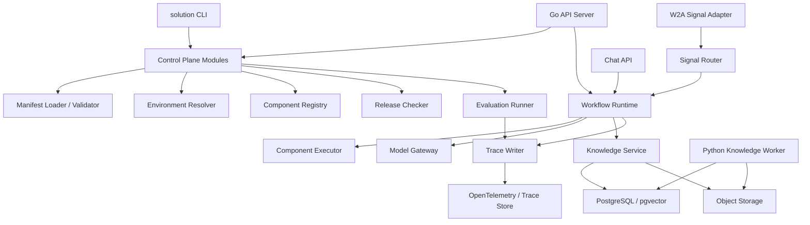

# Solution-as-Code FDE 平台 —— 技术架构与实施规范

## 1. 文档定位

本文档是 `Solution-as-Code FDE 平台` 的工程施工图纸，基于 [Solution-as-Code FDE 平台详细设计](./solution-as-code-fde-platform-design.md) 中已经确定的 Manifest 契约、Runtime 行为、W2A 感知边界、评测门禁和交付约束编写。

本文档不以当前 W2A 协议仓库的技术栈为参考。目标平台应作为独立工程系统建设，只通过协议和适配器集成 W2A。

本文档回答：

- 独立平台应采用什么主流技术栈。
- 服务、CLI、Runtime、Worker、存储和部署如何组织。
- 代码工程如何分层，模块边界如何控制。
- Manifest 校验、Workflow 执行、组件注册表、知识服务、评测、发布检查如何落地。
- 如何从本地 MVCR 平滑演进到企业生产部署。

本文档不重新定义业务设计，不替代产品蓝图；它是开发团队的施工图。

## 2. 架构原则

### 2.1 平台独立

Solution-as-Code 平台是独立系统，不嵌入 W2A 仓库，不继承 W2A 仓库的工程栈。W2A 是感知协议和事件输入来源，平台通过 adapter 消费 W2A Signal。

### 2.2 模块化单体起步

MVCR 使用模块化单体，而不是一开始拆微服务。原因：

- Manifest、Runtime、组件、知识、Trace、评测和发布检查需要快速共享同一份领域模型。
- FDE 平台第一阶段更需要确定性和调试效率，而不是分布式复杂度。
- 模块边界清晰后，Knowledge Worker、Evaluation Worker、Runtime API 可以自然拆分。

### 2.3 控制面与执行面分离

逻辑上分为：

- 控制面：Manifest 管理、校验、组件注册表、评测配置、发布检查、部署产物。
- 执行面：HTTP Runtime、WorkflowExecutor、组件执行、模型调用、知识检索、Trace 写入。
- 数据面：PostgreSQL、对象存储、向量索引、Trace/日志/指标。

MVCR 可部署为一个进程，但代码边界必须按这三类职责组织。

### 2.4 AI 能力通过接口接入

模型供应商、向量库、知识索引、评测 Judge、外部动作系统都必须挂在接口后面。平台核心不绑定某一家模型、不绑定某一种向量数据库、不绑定某个客户系统。

## 3. 推荐技术栈

### 3.1 总体选型

推荐主栈：

- **Go**：CLI、API Server、Workflow Runtime、Manifest Validator、Release Checker。
- **Python**：知识工程 Worker、重文档解析、Embedding、离线评测增强、LLM-as-judge。
- **React + TypeScript**：后续控制台、知识审阅工作台、Trace/Eval 可视化。
- **PostgreSQL + pgvector**：生产元数据、知识单元、向量索引。
- **Redis**：异步任务队列、幂等锁、短期缓存。
- **S3 兼容对象存储**：原始文档、Trace 归档、评测产物、部署包。
- **OpenTelemetry**：Trace、metrics、logs 的统一出口。
- **Docker Compose / Kubernetes**：本地和生产部署。

### 3.2 技术栈矩阵

| 层级 | MVCR | 生产演进 |
|------|------|----------|
| CLI | Go + Cobra | 同一二进制 |
| API Server | Go + chi 或 Gin | Go + OpenAPI + mTLS/Ingress |
| Workflow Runtime | Go | 独立 Runtime Deployment |
| Manifest 校验 | Go + go-yaml + gojsonschema/自定义语义校验 | 生成 JSON Schema + IDE 插件 |
| 组件执行 | Go 内置组件 | gRPC/插件进程/沙箱执行 |
| 知识加载 | Go JSONL loader | Python ingestion worker |
| 知识索引 | 内存关键词索引 | PostgreSQL FTS + pgvector |
| 模型网关 | Go interface + OpenAI-compatible adapter | 多供应商路由、配额、成本控制 |
| 评测 | Go in-process runner | Python/Go hybrid evaluator |
| 数据库 | SQLite 或 PostgreSQL 单机 | PostgreSQL HA |
| 队列 | 进程内任务 | Redis / NATS |
| 对象存储 | 本地文件 | S3/MinIO |
| 可观测性 | JSON Trace + structured logs | OpenTelemetry + Collector |
| 前端 | 暂不实现 | React + TypeScript + TanStack |
| 部署 | Docker Compose | Kubernetes + Helm |

### 3.3 为什么 Go 作为平台内核

Go 适合平台内核，而不是因为当前仓库或 W2A 生态：

- 单二进制 CLI 和 Runtime 交付简单，适合 FDE 客户现场部署。
- 并发、HTTP server、超时、上下文取消、信号处理成熟。
- 类型系统足够严格，工程复杂度低于 JVM/Scala 系。
- 容器镜像小，冷启动快，运维成本低。
- gRPC、OpenTelemetry、PostgreSQL、Redis、Kubernetes 客户端生态成熟。
- 易于在客户 VPC、离线环境、内网部署。

### 3.4 为什么 Python 作为 Worker

Python 不作为 Runtime 主进程，但用于知识工程和 AI 后台任务：

- PDF/Word/OCR/表格解析生态成熟。
- Embedding、重排、评测、LLM-as-judge 生态成熟。
- 可独立横向扩容，不影响在线 Runtime 延迟。

### 3.5 明确不选

- 不用 Node.js 作为平台内核的默认主栈。它适合前端和部分集成，但不是本平台企业级执行内核的首选。
- 不用一开始上微服务。
- 不在第一版引入 Kubernetes Operator。
- 不在第一版引入完整低代码 UI。
- 不在第一版允许任意远程组件代码同进程执行。

## 4. 总体架构



部署形态：

- MVCR：单个 Go 二进制 + 本地文件 + 可选 SQLite/PostgreSQL。
- V1：Go API/Runtime + PostgreSQL + MinIO + Redis + Python Worker。
- V2：Runtime、Knowledge Worker、Evaluation Worker、Control Plane 拆分部署。

## 5. 推荐仓库结构

平台应使用独立仓库，例如：

```text
solution-platform/
  cmd/
    solution/
      main.go
    solution-server/
      main.go
    solution-worker/
      main.py
  internal/
    app/
    manifest/
    environment/
    workflow/
    component/
    registry/
    knowledge/
    evaluation/
    release/
    trace/
    model/
    security/
    delivery/
    storage/
    w2a/
    api/
    shared/
  pkg/
    sdk/
    componentapi/
  workers/
    knowledge/
    evaluation/
  web/
    console/
  deployments/
    docker-compose/
    helm/
  examples/
    after-sales-support/
      manifest.yaml
      data/
        knowledge_units.jsonl
        evals/golden.jsonl
  test/
    fixtures/
    integration/
  docs/
```

目录规则：

- `internal/` 放平台实现，不对外承诺 API。
- `pkg/componentapi` 放未来组件 SDK 的稳定接口。
- `cmd/solution` 和 `cmd/solution-server` 可以复用 `internal/app`。
- `workers/` 可以先为空，等 Phase 2/3 再引入 Python Worker。
- `web/console` 不进入 MVCR 范围，但目录预留。

## 6. 分层依赖规则

依赖方向：

```text
cmd/api/cli
  -> internal/app
    -> manifest / environment / workflow / registry / knowledge / evaluation / release
      -> storage / trace / model / security / shared
```

禁止：

- `workflow` 直接读取数据库或对象存储。
- `component` 直接读取系统环境变量。
- `api` 层做业务判断。
- `release` 修改 Manifest。
- `evaluation` 依赖 HTTP 端口。
- 任意模块绕过 `trace.Writer` 写 Trace。

必须：

- 所有外部 I/O 通过接口封装。
- 所有长耗时调用带 `context.Context`。
- 所有模型、检索、组件执行带 timeout。
- 所有错误可映射为机器可读 code。

## 7. 核心模块施工规范

### 7.1 Manifest Loader

职责：

- 读取 YAML。
- 保留源位置。
- 解析到 Go struct。
- 输出结构错误和语义错误。

推荐库：

- YAML：`gopkg.in/yaml.v3`
- JSON Schema：`github.com/santhosh-tekuri/jsonschema/v6` 或自定义结构校验
- 错误路径：自定义 `FieldPath`

关键类型：

```go
type SolutionManifest struct {
    APIVersion   string          `yaml:"apiVersion"`
    Kind         string          `yaml:"kind"`
    Metadata     MetadataSpec    `yaml:"metadata"`
    Perception   PerceptionSpec  `yaml:"perception"`
    Knowledge    KnowledgeSpec   `yaml:"knowledge"`
    Components   []ComponentSpec `yaml:"components"`
    SolutionType string          `yaml:"solutionType"`
    Workflow     WorkflowSpec    `yaml:"workflow"`
    Runtime      RuntimeSpec     `yaml:"runtime"`
    Evaluation   EvaluationSpec  `yaml:"evaluation"`
    Delivery     DeliverySpec    `yaml:"delivery"`
}
```

### 7.2 Manifest Validator

Validator 必须分阶段执行：

```text
structure
unique ids
cross references
secret refs
workflow syntax
workflow dataflow
component input contracts
knowledge schema
evaluation gates
release checks
```

错误格式：

```json
{
  "code": "WORKFLOW_UNSAFE_DEPENDENCY",
  "path": "workflow.nodes[3].inputs.passages",
  "message": "Node generate_answer references output from a node that may be skipped",
  "hint": "Remove the upstream when condition or guard both nodes in the same branch"
}
```

关键规则：

- `workflow.nodes[].inputs` 不能引用后置节点。
- `workflow.nodes[].inputs` 与 `when` 不能引用带 `when` 的上游节点输出。
- `when` 仅支持 `node_id.field` 一层访问。
- `human_handoff.reason` 是 optional。
- `knowledge.sources[].type` 在 Phase 1 中直接使用实现格式（如 `jsonl`），等价于语义类型 `document` + 格式 `jsonl`。后续阶段将引入独立的 `format` 字段。`knowledge.schemas[].fields` 在 MVCR 中主要作为结构说明；完整 required 校验属于 Phase 2 ingest，但 Phase 1 `solution run` 必须校验 JSONL 记录的最小契约：至少一个可检索文本字段和引用字段，默认引用字段为 `source_ref`。
- `delivery.environments[].config` 只能覆盖白名单字段。

### 7.3 Environment Resolver

职责：

- 根据 `--env` 选择环境。
- 解析 `env:VAR_NAME`。
- 应用环境覆盖白名单。
- 输出脱敏配置摘要。
- Phase 1 不读取向量存储配置；`vectorStorePath` 仅属于 Phase 2+ 的向量检索实现。

Go 类型：

```go
type ResolvedEnvironment struct {
    EnvironmentName  string
    EnvironmentType  string
    ModelKey         SecretRef
    DefaultModel     string
    FallbackModel    string
    MaxLatencyMs     int
    MaxCostPerRunUsd float64
    TracePath        string
    RetainDays       int
}
```

`EnvironmentName` 和 `EnvironmentType` 分别来自 `delivery.environments[].name` 与 `delivery.environments[].type`，供 `RuntimeContext.Env()`、Trace、release report 和少量非业务行为读取。组件不得基于环境名改变业务语义。

安全要求：

- `SecretRef.String()` 不返回明文。
- 日志和 Trace 只能看到 secret name，不能看到 value。
- 未声明在 Manifest 环境配置中的系统环境变量不得被隐式读取。

### 7.4 W2A Adapter

W2A 只作为外部世界信号输入。平台实现一个 W2A adapter：

职责：

- 通过 `SensorRegistry` 解析 `perception.sensors[].ref`，MVP 内置 `@world2agent/sensor-webhook@1.0.0` 和本地 mock Sensor；解析结果必须是结构化 Sensor descriptor，不允许在入口代码中散落字符串特判。
- 按 Manifest 注册 `endpointPath`。
- 校验 Bearer token。
- 使用 `schema_version` 对应的预定义 schema 校验 W2A 标准 envelope；官方 SDK 可以作为协议依赖，但平台核心不依赖 W2A 仓库运行时栈。
- 拒绝未知 `schema_version`；MVP 只接受 `w2a/0.1`。
- 校验 W2A `event.type` 是否在 Manifest `signalTypes` 白名单中。
- 以 `environment + source.sensor_id + signal_id` 作为幂等键，重复请求不得重复执行 Workflow。
- 将 W2A 标准 envelope 原样放入 `RuntimeRequest.signal`。

RuntimeRequest 保留字段：

| W2A 字段 | RuntimeRequest 字段 |
|----------|----------------------|
| `event.type` | `trigger.signalType` |
| 完整 W2A envelope | `signal` |
| 原始 body | `raw_payload` |

`inputMapping` 直接读取标准 W2A 路径，例如 `signal.source_event.data.description`、`signal.event.summary`。如果客户系统不是标准 W2A envelope，可在 `sensor-webhook` adapter 中显式配置转换；Workflow Runtime 不直接理解客户私有 payload。

`source_event.schema` 是可选的生产者自描述信息，MVP 不要求每条 Signal 携带，也不依赖它做协议校验。业务字段是否满足当前 Solution 需要，由 `workflow.inputMapping` 必填路径和后续组件输入契约共同约束。

Sensor 解析接口：

```go
type SensorRegistry interface {
    Resolve(ref string) (SensorDescriptor, error)
}

type SensorDescriptor struct {
    Ref      string
    Kind     string
    BuiltIn  bool
    Version  string
}
```

幂等存储接口：

```go
type SignalIdempotencyStore interface {
    Get(ctx context.Context, key SignalIdempotencyKey) (*IdempotencyRecord, bool, error)
    Put(ctx context.Context, key SignalIdempotencyKey, record IdempotencyRecord, ttl time.Duration) error
}
```

MVCR 使用进程内 map + TTL，默认 TTL 24 小时，Runtime 重启后不保证幂等状态保留。生产演进使用 Redis 或 PostgreSQL，并复用同一接口。`IdempotencyRecord` 保存终态响应或入口拒绝结果；重复请求返回已保存结果，并标记 `duplicate: true`。

### 7.5 RuntimeRequest

Go 类型：

```go
type RuntimeRequest struct {
    Trigger    TriggerSpec            `json:"trigger"`
    Request    map[string]any         `json:"request,omitempty"`
    Signal     *W2ASignal             `json:"signal,omitempty"`
    RawPayload any                    `json:"raw_payload"`
}

type TriggerSpec struct {
    Type       string `json:"type"`
    Sensor     string `json:"sensor,omitempty"`
    SignalType string `json:"signalType,omitempty"`
}
```

所有入口都必须归一化为 `RuntimeRequest`。

### 7.6 Workflow Runtime

WorkflowExecutor 是执行面核心。

流程：

```text
RuntimeRequest
  -> inputMapping
  -> initial inputs
  -> for each node
        -> evaluate when
        -> build node input
        -> execute component with retry
        -> write step output
        -> write span
  -> response mapping
```

必须实现：

- `inputMapping` 简单路径读取。
- `when` MVP parser。
- `workflow.nodes[].inputs` 映射。
- 当前节点 retry。
- fallback 模式。
- `context.error` 注入。
- Trace span。
- 节点级 `continueOnFailure`。
- action 节点默认硬失败中断；显式 `continueOnFailure: true` 时才软失败继续。processor 节点始终硬失败中断。
- response mapping 按 `answer`、`intent`、`confidence`、`citations`、`actions` 的顺序组装。

禁止：

- 使用通用脚本引擎执行 `when`。
- 将 `step_outputs` 整体传给组件。
- 在 Runtime 中硬编码 `answer_generator` 节点名。

### 7.7 Response Mapping

WorkflowExecutor 结束后按确定性规则组装响应：

1. `traceId` 由 TraceWriter 生成。
2. `intent` 和 `confidence` 取自第一个成功返回这两个字段的 processor 节点。
3. `answer` 取自最后一个成功返回 `answer` 的 processor 节点。
4. `citations` 优先取 `answer` 来源节点的 `citations`；若缺失则回退到最近的 retriever 输出。
5. `actions` 按执行顺序收集所有已执行 action 节点输出；soft failure action 的输出被原样收集（如 `{"status": "failed", ...}`），平台不额外注入 `error` 字段。
6. hard failure 时不组装正常业务响应，只返回错误响应和 Trace。

### 7.8 Component Runtime

Go 接口：

```go
type Component interface {
    ID() string
    Category() ComponentCategory
    Run(ctx context.Context, input map[string]any, runtime RuntimeContext) (map[string]any, error)
}
```

组件输出：

- 必须是一层 JSON object。
- processor 组件返回业务输出，供后续节点和 Trace 使用。
- processor 组件通过返回值 `(nil, error)` 表达不可恢复的系统异常；action 组件的系统异常同样通过 `(nil, error)` 返回，可恢复的业务失败通过 `output["status"] = "failed"` 表达。任何组件不得使用 `"error"` 作为 status 值。

Action 节点策略：

- 默认 `continueOnFailure: false`，表示 action 通过 `(nil, error)` 返回系统异常或 `output["status"] = "failed"` 时按硬失败处理。
- 如需允许软失败继续，必须显式配置 `continueOnFailure: true`。
- `processor` 节点始终硬失败，不能配置 `continueOnFailure`。

Go 接口：

```go
type RuntimeContext interface {
    // Phase 1 可用
    Env() ReadOnlyEnv
    Trace() TraceSink
    Knowledge() KnowledgeReader          // Retrieve() 知识检索
    Actions() ActionSummaryReader
    Logger() Logger                      // 结构化日志（Phase 1 提供基本实现）
    Request() RequestMetadata
    Error() *RuntimeErrorSummary         // fallback 模式下可读的错误上下文
    // Phase 1 可用（模型调用）
    Model() ModelGateway                 // LLM 调用（Phase 1 提供基于环境密钥的最小实现）
    // Phase 2 可用
    // HTTP() HTTPCaller                 // 外部 API 调用
}

type ActionSummaryReader interface {
    List() []ActionSummary
}
```

接口说明：

- `Env()` 只暴露环境解析后的只读配置。
- `Trace()` 只允许写 span 和字段。
- `Model()` 只暴露模型调用能力。
- `Knowledge()` 只暴露检索能力（`Retrieve(ctx, query, topK) → KnowledgeResult`），Phase 1 实现关键词检索。
- `Logger()` 只允许结构化日志和脱敏。
- `Request()` 提供 trigger、signal、raw payload 等请求元数据。
- `Error()` 仅在 fallback 模式下可读。
- `Actions()` 只读返回已完成 action 的结构化摘要；它只用于后续节点读取执行结果，不改变控制流，不回写 action 状态。
- `human_handoff` 在 fallback 模式下必须读取 `Error()`，并将 `failedNode`、`type`、`message` 写入 action 输出和 Trace。

内置 MVCR 组件（Phase 1，版本均为 `@1.0.0`）：

- `llm-classifier` — `registry.intent.support-router@1.0.0`（通用意图分类器）
- `llm-classifier` — `registry.intent.beverage-router@1.0.0`（饮品场景意图分类器）
- `llm-classifier` — `registry.intent.severity-beverage@1.0.0`（饮品场景严重度判断）
- `retriever` — `registry.retriever.local-keyword@1.0.0`（关键词检索器）
- `llm-generator` — `registry.agent.cited-answer@1.0.0`（带引用回答生成器）
- `human-handoff` — `registry.action.human-handoff@1.0.0`（人工升级）
- `mock action` — `registry.action.mock-create-service-ticket@1.0.0`（mock 工单创建）

### 7.9 Component Registry

引用格式：

```text
registry.<namespace>.<name>@<semver>
```

本地目录：

```text
components/registry/<namespace>/<name>/<version>/component.yaml
```

MVCR 可用内置 map 实现，但接口必须按 registry 设计：

```go
type ComponentRegistry interface {
    Resolve(ref string) (ComponentDescriptor, error)
    Instantiate(id string, ref string, config map[string]any) (Component, error)
}

type ComponentDescriptor struct {
    Ref         string
    Category    string
    ConfigSchema map[string]string
    InputSchema map[string]string
    OutputSchema map[string]string
}
```

约定：

- `namespace` 表示组件家族或能力域，例如 `intent`、`retriever`、`agent`、`action`。
- `ComponentSpec.category` 仍只允许 `processor` / `action`，用于声明运行时角色。
- registry 引用中的 `namespace` 不能使用 `processor` 这种运行时角色；例如 `registry.intent.severity-beverage@1.0.0` 可以对应 `category: processor`。
- `ComponentDescriptor.ConfigSchema` 采用扁平 `field -> primitive type` 表达，用于 `Instantiate()` 时校验 `components[].config`；`InputSchema` 和 `OutputSchema` 用于运行时节点输入与输出校验。`config` 与运行时输入是不同契约，禁止互相替代。
- `ComponentDescriptor.InputSchema` 和 `OutputSchema` 采用扁平 `field -> primitive type` 表达，MVP 只需要 `string`、`number`、`boolean`、`object`、`array` 五类基础类型，用于 `workflow.nodes[].inputs` 的最小类型校验与输出字段校验。

远程组件市场放到后续版本，必须支持签名、权限、版本锁定、隔离执行。

### 7.10 Knowledge Service

Phase 1：

- Go JSONL loader。
- 最小质量报告，默认写入 `dirname(tracePath)/reports/knowledge-quality.json`。
- 内存关键词索引。
- `context.knowledge.retrieve(query, topK)`。
- 每条非空 JSONL 记录必须至少包含一个可检索文本字段和引用字段，默认引用字段为 `source_ref`。
- 文件缺失、JSONL 解析失败、非空记录缺少可检索文本字段或引用字段属于 block，必须终止 `solution run` 启动；记录数为 0 属于 warning。

Phase 2+：

- PostgreSQL 存知识单元。
- PostgreSQL FTS 做关键词检索。
- 每个 Solution 或 embedding profile 生成独立的固定维度向量索引，避免多个维度共享同一张 `vector` 列。
- Python Worker 只负责重文档解析、OCR、embedding、重排等离线任务；初始集成边界为文件系统交换 JSONL，不在 Runtime 请求路径内调用 Python。

Go/Python 边界：

- Phase 1 保持纯 Go：`solution run` 直接加载 JSONL 并构建内存关键词索引。
- Phase 2 的 `solution ingest` 仍由 Go CLI 编排；当知识源是 PDF、Word、图片或 Markdown 等重文档时，Go 调用 Python Worker 生成标准 JSONL 中间产物。
- Go ingest 读取 Python 输出的 JSONL，执行 Schema 门禁、质量报告生成和 PostgreSQL 写入。
- Python Worker 可部署为本地子进程、独立容器或 Kubernetes Job，但接口先保持“输入文件/目录 -> 输出 JSONL + worker report”，不引入 gRPC 作为第一版强依赖。

embedding 配置：

```go
type EmbeddingSpec struct {
    Family   string
    Dim      int
    Provider string
}
```

约定：

- `runtime.embedding` 是方案级配置，但只在 Phase 2+ 生效。
- 默认 family 可由实现选择，但同一解决方案内必须固定。
- 同一 Solution 内的向量维度必须固定，不能在同一张表或同一个 `vector` 列里混存不同维度。

知识单元表：

```sql
create table knowledge_units (
  id uuid primary key,
  solution_id text not null,
  source_id text not null,
  schema_id text not null,
  fields jsonb not null,
  source_ref text not null,
  content text not null,
  created_at timestamptz not null,
  updated_at timestamptz not null
);
```

解决方案向量索引表应按 solution/profile 独立创建，示例：

```sql
create table knowledge_embeddings__<solution_id>__<profile> (
  knowledge_unit_id uuid primary key references knowledge_units(id),
  solution_id text not null,
  embedding_profile text not null,
  embedding vector(<dim>) not null,
  created_at timestamptz not null
);
```

### 7.11 Model Gateway

接口：

```go
type ModelGateway interface {
    Generate(ctx context.Context, req GenerateRequest) (GenerateResponse, error)
}
```

要求：

- 支持 OpenAI-compatible API。
- 支持 timeout。
- 支持 fallback model。
- 支持 cost/usage 记录。
- 支持 mock provider 供测试。

第一版不做复杂模型路由；模型网关必须预留 provider interface。

### 7.12 Trace Writer

MVCR：

- JSON 文件写入 `tracePath`。
- 每次请求一个 Trace。
- 每个节点一个 span。
- 失败路径写 `error`。

生产：

- OpenTelemetry SDK。
- OTLP Collector。
- Trace 文件可作为本地 fallback。

接口：

```go
type TraceWriter interface {
    Start(ctx context.Context, meta TraceMeta) (TraceHandle, error)
    AppendSpan(ctx context.Context, traceID string, span TraceSpan) error
    Finish(ctx context.Context, traceID string, status string, err *RuntimeErrorSummary) error
}

type TraceReader interface {
    Get(ctx context.Context, traceID string) (*TraceRecord, error)
    ListByRun(ctx context.Context, runID string) ([]TraceRecord, error)
}
```

MVCR 实现 `FileTraceWriter` / `FileTraceReader`；生产实现 `OTLPTraceWriter`，必要时通过对象存储归档或 OTel backend 查询实现 `TraceReader`。评测执行器必须通过 `TraceReader` 或本次执行返回的 `TraceRecord` 读取 Trace，不直接读取具体文件路径。

Trace 记录：

```go
type TraceRecord struct {
    TraceID     string
    Solution    string
    Version     string
    Environment string
    Trigger     TriggerSpec
    Input       map[string]any
    Spans       []TraceSpan
    LatencyMS   int64
    Status      string
    Error       *RuntimeErrorSummary
}
```

## 8. API 设计

### 8.1 HTTP API

MVCR API：

```text
GET  /health
POST /chat
POST <manifest endpointPath>
```

后续控制面 API：

```text
POST /v1/solutions/validate
POST /v1/solutions/run
POST /v1/evaluations/run
POST /v1/releases/check
GET  /v1/traces/{traceId}
```

### 8.2 Chat API

```http
POST /chat
Content-Type: application/json
```

```json
{
  "message": "The pump shows E42. What should I do?",
  "sessionId": "optional-session-id"
}
```

### 8.3 W2A Webhook

```http
POST /w2a/tickets
Authorization: Bearer <token>
Content-Type: application/json
```

认证失败：

- 返回 401。
- 不进入 WorkflowExecutor。
- 写安全审计日志。

Signal 类型不匹配：

- 返回 400。
- 不进入 WorkflowExecutor。
- 写拒绝类 Trace 或审计日志。

## 9. CLI 规范

CLI 使用 Go + Cobra。

命令：

M1 命令：

```bash
solution validate manifest.yaml
solution run manifest.yaml --env=poc
```

M2+ 命令：

```bash
solution ingest manifest.yaml --env=poc
solution evaluate manifest.yaml --env=poc
solution release manifest.yaml --env=production
solution destroy manifest.yaml --env=production
```

输出规范：

- 默认人类可读。
- `--json` 输出机器可读 JSON。
- 校验失败退出码 1。
- 系统错误退出码 2。

示例：

```bash
solution validate manifest.yaml --json
```

```json
{
  "status": "failed",
  "errors": [
    {
      "code": "MISSING_REQUIRED_FIELD",
      "path": "metadata.name",
      "message": "metadata.name is required"
    }
  ]
}
```

## 10. 存储架构

### 10.1 MVCR 本地存储

MVCR 使用 Manifest 所在目录下的 `data/<env>/` 作为本地存储根目录，与设计文档和用户故事示例中的路径约定一致：

```text
data/
  <env>/
    traces/
    reports/
    indexes/
    releases/
```

适合：

- 本地 PoC。
- 单 FDE 演示。
- CI 测试。

### 10.2 生产存储

| 数据 | 存储 |
|------|------|
| Solution metadata | PostgreSQL |
| Manifest versions | PostgreSQL + 对象存储 |
| Component metadata | PostgreSQL |
| Knowledge units | PostgreSQL |
| Vector index | pgvector |
| Raw documents | S3/MinIO |
| Trace | OpenTelemetry backend + 对象存储归档 |
| Eval reports | PostgreSQL + 对象存储 |
| Release artifacts | S3/MinIO |

## 11. 评测架构

MVCR 评测以进程内 WorkflowExecutor 执行，不依赖 HTTP 端口：

```text
runtime_request_jsonl
  -> RuntimeRequest
  -> WorkflowExecutor
  -> TraceRecord
  -> Metrics
  -> Gates
```

指标：

- `citation_coverage`
- `answer_accuracy`
- `groundedness`
- `handoff_precision`

评测输出必须同时包含：

- 指标值。
- gate 状态。
- 失败 case 摘要。
- 每个 case 的 traceId。

## 12. 发布检查架构

Release Checker 是同步阻断器。

执行顺序：

1. `model_credentials_configured`
2. `sensor_credentials_configured`
3. `action_credentials_configured`
4. `signal_ingress_reachable`
5. `knowledge_quality_passed`
6. `eval_gates_passed`
7. `observability_enabled`
8. `security_baseline_passed`

规则：

- 任一 block 检查失败，退出码为 1。
- 不生成部署产物。
- 输出 machine-readable report。
- 所有检查必须可单测。
- `action_credentials_configured` 检查 action 组件配置中的 `apiKeyRef`、`tokenRef`、`secretRef` 等敏感引用是否存在且非空。
- `knowledge_quality_passed` 读取 `dirname(tracePath)/reports/knowledge-quality.json` 或 Phase 2 ingest 报告；报告缺失、fingerprint 不匹配、超过 24 小时或存在 block 项都失败。报告写入必须先落到临时文件，再原子 rename 到最终路径。
- `eval_gates_passed` 现场执行 `schedule: onRelease` 且 `severity: block` 的评测门禁，或在 fingerprint 匹配且未过期（默认 1 小时）时复用缓存；`schedule: weekly` 只产生告警和报告，不影响 `solution release` 成功退出。

成功产物：

- `solution release` 成功时生成部署产物目录 `./deploy/<env>/`。
- 目录内至少包含 `docker-compose.yaml`、`.env.example`、运行说明和重建说明。
- `docker-compose.yaml` 必须启动同一个 Go Runtime 二进制和同一份解析后的 Manifest/config，不得重新实现一套与 `solution run` 行为不同的服务逻辑。
- 实现可额外生成 K8s 清单或脚本，但目录契约不得变化。

## 13. 部署架构

### 13.1 本地 PoC

```text
solution run manifest.yaml --env=poc
```

进程内包含：

- HTTP Server。
- Workflow Runtime。
- 内置组件：`llm-classifier`（`registry.intent.support-router@1.0.0`、`registry.intent.beverage-router@1.0.0`、`registry.intent.severity-beverage@1.0.0`）、`retriever`（`registry.retriever.local-keyword@1.0.0`）、`llm-generator`（`registry.agent.cited-answer@1.0.0`）、`human-handoff`（`registry.action.human-handoff@1.0.0`）、mock action（`registry.action.mock-create-service-ticket@1.0.0`）。
- JSONL Knowledge index。
- Trace file writer。

### 13.2 Docker Compose

服务：

- `solution-runtime`
- `postgres`
- `redis`
- `minio`
- `otel-collector`（可选）

Volumes：

- `postgres-data`
- `minio-data`
- `trace-data`

### 13.3 Kubernetes

生产建议：

```text
solution-api Deployment
solution-runtime Deployment
solution-worker Deployment
postgres managed service
redis managed service
object storage managed service
otel-collector DaemonSet/Deployment
```

Kubernetes 资源：

- Deployment
- Service
- Ingress
- ConfigMap
- Secret reference
- PVC
- NetworkPolicy
- HPA
- PodDisruptionBudget

### 13.4 客户 VPC

客户 VPC 部署必须支持：

- 无公网依赖或明确 allowlist。
- 镜像私有仓库。
- Secret 由客户 KMS/Secret Manager 管理。
- Trace 可写客户自有观测系统。
- 模型供应商 endpoint 可配置。

## 14. 安全规范

### 14.1 密钥

- Manifest 只允许 `env:VAR_NAME` 或后续密钥引用。
- 解析后的密钥只存在内存。
- 日志、Trace、错误、评测报告不得出现密钥明文。
- release check 必须检查密钥引用是否存在且非空。

### 14.2 Webhook 安全

- production endpointPath 必须校验 Bearer token。
- 请求体大小限制。
- 超时限制。
- signalType 白名单。
- M1 必须基于 W2A `signal_id` 实现进程内 TTL 幂等保护；生产演进到 Redis/PostgreSQL 持久化幂等存储。

### 14.3 组件安全

MVCR 只允许内置组件和本地白名单组件。

后续远程组件必须具备：

- 签名。
- checksum。
- 权限声明。
- 资源限制。
- 独立进程或沙箱隔离。

### 14.4 Prompt Injection Baseline

MVCR 至少实现配置级检查：

- `delivery.security.promptInjectionDefense: required`
- `runtime.observability.trace: required`
- 检索结果必须带 citations。
- answer generator 必须要求引用约束。

## 15. 可观测性规范

### 15.1 Trace

每次请求必须生成 Trace：

- Chat。
- W2A Signal。
- Evaluation case。

Trace 必须包含：

- trigger。
- mapped inputs。
- node spans。
- component outputs。
- citations。
- latency。
- error。

### 15.2 Metrics

建议指标：

- `workflow_runs_total`
- `workflow_run_duration_ms`
- `component_run_duration_ms`
- `component_failures_total`
- `model_cost_usd`
- `retrieval_empty_total`
- `release_check_failures_total`

### 15.3 Logs

- structured JSON。
- 每条日志带 `traceId`。
- 密钥脱敏。
- 错误日志带 machine-readable code。

## 16. 测试策略

### 16.1 单元测试

必须覆盖：

- Manifest 结构校验。
- 交叉引用校验。
- when parser。
- inputMapping。
- unsafe dependency。
- EnvironmentResolver。
- JSONL quality report。
- keyword retrieval。
- SignalIdempotencyStore。
- fallback。
- release checks。

### 16.2 集成测试

必须覆盖：

- `solution validate` 成功与失败。
- `solution run` 后 `/chat` 返回 answer/citations/traceId。
- `/w2a/tickets` bearer token 成功触发工作流。
- 认证失败不进入工作流。
- 相同 `environment + sensor_id + signal_id` 重复发送时不重复执行工作流，返回缓存结果。
- Trace 文件生成。
- `solution evaluate` 产生指标。
- `solution release` 在 gate 失败时退出 1。
- `solution release` 执行 onRelease 评测门禁，并在 action 凭证缺失时失败。
- `solution release` 成功时生成 `./deploy/<env>/` 部署产物。
- `schedule: weekly` 门禁失败不阻断 release。

### 16.3 契约测试

必须维护：

- Manifest fixture。
- Component input/output fixture。
- RuntimeRequest fixture。
- W2A Signal fixture。
- Trace fixture。
- Eval JSONL fixture。

## 17. CI/CD

Go CI：

```yaml
steps:
  - go test ./...
  - go vet ./...
  - golangci-lint run
  - go build ./cmd/solution
  - go build ./cmd/solution-server
```

Python Worker CI：

```yaml
steps:
  - uv sync
  - ruff check .
  - mypy .
  - pytest
```

Container CI：

```yaml
steps:
  - docker build -f build/runtime.Dockerfile .
  - docker compose -f deployments/docker-compose/docker-compose.yaml config
```

质量门槛：

- 所有示例 Manifest 必须 validate 通过。
- 所有 release gate 测试必须稳定。
- 核心模块必须有单元测试。
- CI 不依赖外部模型供应商，模型调用使用 mock provider。

## 18. 实施路线

### M1：Manifest-driven Local Runtime

范围：

- Go CLI：`validate`、`run`。
- Manifest Loader/Validator。
- Environment Resolver。
- HTTP `/chat`、`/health`、`endpointPath`。
- WorkflowExecutor。
- 内置组件：`llm-classifier`（`registry.intent.support-router@1.0.0`、`registry.intent.beverage-router@1.0.0`、`registry.intent.severity-beverage@1.0.0`）、`retriever`（`registry.retriever.local-keyword@1.0.0`）、`llm-generator`（`registry.agent.cited-answer@1.0.0`）、`human-handoff`（`registry.action.human-handoff@1.0.0`）、mock action（`registry.action.mock-create-service-ticket@1.0.0`）。
- JSONL KnowledgeLoader。
- SensorRegistry。
- SignalIdempotencyStore。
- TraceWriter。

验收：

- 售后助手 Manifest 可启动本地服务。
- Chat 和 W2A Signal 进入同一工作流。
- Trace 生成。
- unsafe inputs 引用被拒绝。

### M2：Registry and Knowledge Pipeline

范围：

- 本地 ComponentRegistry。
- `component.yaml`。
- `solution ingest`。
- PostgreSQL schema 草案。
- Python Worker 原型。

### M3：Evaluation and Release Gates

范围：

- `solution evaluate`。
- runtime_request_jsonl runner。
- metrics。
- `solution release`。
- release report。

### M4：Production Packaging

范围：

- Docker Compose。
- PostgreSQL/Redis/MinIO 集成。
- `.env.example`。
- 可选 `solution destroy`。
- Kubernetes manifest 草案。

## 19. 演进路径

### 19.1 服务拆分顺序

只有在模块压力明确出现后拆分：

1. Knowledge Worker。
2. Evaluation Worker。
3. Runtime API。
4. Control Plane API。
5. Component Sandbox Service。

### 19.2 存储演进

| 阶段 | 元数据 | 知识 | Trace | 文件 |
|------|--------|------|-------|------|
| MVCR | 本地文件/SQLite | 内存索引 | JSON 文件 | 本地目录 |
| V1 | PostgreSQL | PostgreSQL FTS | OTLP + 文件 | MinIO |
| V2 | PostgreSQL HA | pgvector/OpenSearch | OTel backend | S3 |

### 19.3 工作流演进

MVCR：

- 线性节点。
- 简单 `when`。
- 无并行。

后续：

- 具名 workflow。
- 分支路径标识。
- 子 workflow。
- 异步 action。
- 人工审批节点。

## 20. 工程约束清单

开发团队必须遵守：

- Manifest 是唯一可信源。
- W2A 只是感知输入，不决定业务动作。
- Runtime 不硬编码业务节点 ID。
- HTTP 层不做业务判断。
- 组件不能读取全局环境变量。
- 组件不能绕过 TraceWriter。
- 所有 I/O 带 timeout。
- 所有 release check 可单测。
- 所有新增环境覆盖字段必须加入白名单和 Validator。
- 所有远程组件必须经过隔离设计后才能执行。

## 21. 首个里程碑推荐

首个里程碑：

```text
M1: Manifest-driven Local Runtime
```

交付物：

- 一个 Go `solution` CLI。
- 一个 Go Runtime Server。
- 一个售后助手 example。
- 一个 JSONL 知识源。
- 一个 W2A webhook 入口。
- 一套 JSON Trace。

不交付：

- UI。
- 远程组件市场。
- 多租户控制面。
- Kubernetes Operator。
- 完整知识工作台。

M1 完成后，团队即可进入阶段 1 编码实施，并以设计文档中的 MVP 验收标准作为工程验收标准。
